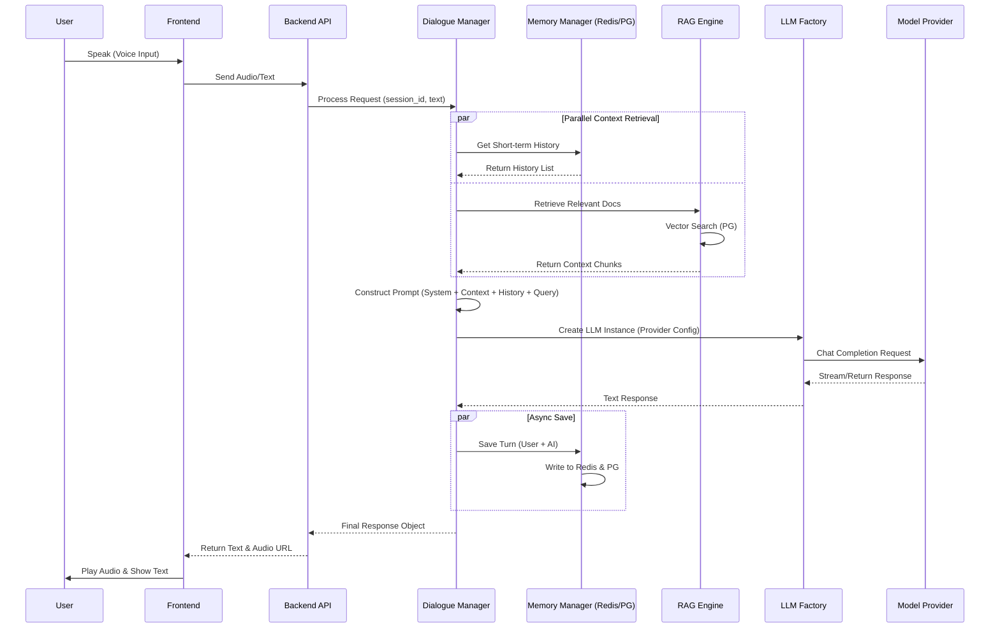

# AI Voice Solution (Audio AI)

基于大模型技术的智能语音语义理解系统，专为智能微波炉等硬件设备设计。

## 核心特性

*   **多模型支持**：无缝集成 Azure OpenAI, Qwen (通义千问), Minimax, Deepseek, OpenAI, Zhipu AI (智谱), Baidu Qianfan (文心一言), Google Gemini, Xunfei Spark (讯飞星火)。
*   **智能路由**：基于 LLM 的意图分类，动态路由至指令控制、RAG 问答或通用对话。
*   **RAG 引擎**：基于 PostgreSQL (pgvector) 的向量检索，支持文档上传与自动索引。
*   **指令引擎**：支持复合指令解析与互斥逻辑检查。
*   **记忆系统**：Redis 短期记忆 + PostgreSQL 中长期记忆（用户画像）。

---

## 🏗️ 系统架构 (System Architecture)

### 1. 系统流程图 (Flowchart)

展示了从用户语音输入到系统最终响应的完整数据流向。


### 2. 核心调用时序 (Sequence Diagram)



---

## 🚀 快速开始（推荐：Docker 一键启动）

使用 Docker 是最简单的运行方式，您**无需**在本地安装 Python、PostgreSQL 或 Redis。

### 1. 前置要求

*   安装 [Docker Desktop](https://www.docker.com/products/docker-desktop/) (Windows/Mac/Linux)

### 2. 配置环境变量

复制示例配置文件，并填入您的 API Key。

```bash
# Windows PowerShell
copy .env.example .env

# Linux / Mac
cp .env.example .env
```

打开 `.env` 文件，至少配置以下一项大模型服务：

```ini
# 示例：使用 OpenAI
DEFAULT_LLM_PROVIDER=openai
DEFAULT_LLM_MODEL=gpt-3.5-turbo
OPENAI_API_KEY=sk-xxxxxx
```

### 3. 启动服务

在项目根目录下运行：

```bash
docker-compose up -d
```

此命令会自动：
1.  启动带有 `vector` 插件的 PostgreSQL 数据库。
2.  启动 Redis 缓存服务。
3.  构建并启动 API 服务容器（自动安装所有 Python 依赖）。

### 4. 验证运行

启动成功后，访问 Swagger 文档：
👉 **http://localhost:8000/docs**

---

## 🛠️ 本地源码开发（仅限调试）

如果您需要修改代码或进行调试，可以选择在本地运行。

### 1. 环境准备

*   Python 3.10+
*   PostgreSQL 15+ (必须安装 `pgvector` 插件)
*   **Redis 5.0+** (Windows 下可使用 5.0.14 版本)

### 2. 数据库初始化 (Database Setup)

在首次运行代码之前，**必须**执行初始化脚本以创建数据库和表结构。

**PostgreSQL 初始化：**
我们提供了一键初始化脚本，它会自动：
1.  检查并创建 `audio_ai` 数据库（如果不存在）。
2.  启用 `vector` 扩展（用于 RAG）。
3.  根据 `models.py` 定义创建所有数据表。

```bash
# 确保已激活虚拟环境
python scripts/init_db.py
```

**Redis 初始化：**
Redis 是 Schema-less 的，**无需建表**。只需确保 Redis 服务已启动即可。
*   **数据结构**：使用 List 存储会话历史。
*   **Key 格式**：`session:{session_id}:history`

### 3. Windows 环境特别说明

**便捷脚本工具：**
我们在 `scripts/` 目录下提供了 `manage_services.py` 脚本，用于在 Windows 本地一键启停 Redis 和 PostgreSQL 服务（需先修改脚本内的安装路径配置）。

```bash
# 启动服务（会弹出两个独立窗口）
python scripts/manage_services.py start

# 停止服务（优雅关闭并保存数据）
python scripts/manage_services.py stop
```

**关于 PostgreSQL 安装：**
Windows 下安装带有 pgvector 的 Postgres 比较复杂，建议**仅数据库使用 Docker 启动**，而代码在本地运行：

```bash
# 仅启动数据库和Redis容器
docker-compose up -d db redis
```

### 4. 安装依赖与启动

```bash
# 创建虚拟环境
python -m venv venv
# 激活虚拟环境 (Windows)
.\venv\Scripts\activate
# 激活虚拟环境 (Linux/Mac)
source venv/bin/activate

# 安装依赖
pip install -r requirements.txt

# 启动服务
uvicorn app.main:app --reload
```

---

## API 使用指南

### 1. 核心对话接口

**POST** `/api/v1/chat/completions`

```json
{
  "query": "帮我把微波炉开到大火，加热5分钟",
  "session_id": "sess_001",
  "user_id": "user_123"
}
```

### 2. 上传知识库文档

**POST** `/api/v1/admin/documents/upload`

*   `file`: 选择 PDF/Word/TXT 文件

### 3. 配置指令

**POST** `/api/v1/admin/instructions`

```json
{
  "name": "set_firepower",
  "description": "设置火力大小",
  "parameters": { ... }
}
```
