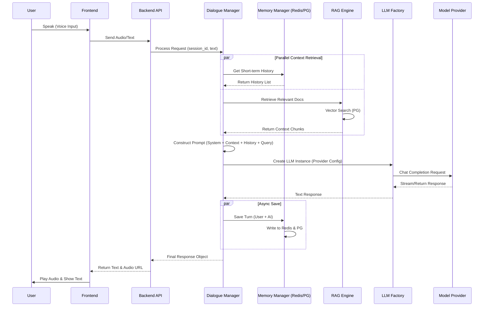

# AI Voice Solution (v2.1)

Commercial-grade AI voice and semantic understanding system with Multi-Tenant Architecture, Advanced RAG, and Admin Dashboard.

## 🌟 New Features (v2.1)

*   **Multi-Tenant Architecture**: Full data isolation based on User ID.
*   **Advanced RAG Engine**: 
    *   Configurable indexing modes (High Quality / Economy).
    *   Hybrid retrieval (Vector + Full-Text).
    *   Rerank support with adjustable Top-K and Score Threshold.
*   **Instruction Management**: 
    *   CRUD operations for Function Calling definitions.
    *   Excel import support.
    *   Mutex logic validation.
*   **Batch Evaluation**: 
    *   Upload Excel test cases.
    *   Automated intent and keyword matching.
    *   Downloadable evaluation reports.
*   **Chat Debugger**: 
    *   Multi-session management.
    *   Real-time latency and routing metadata.
    *   Trace ID tracking.

## 📚 最佳实践 (Best Practices)

我们整理了针对不同厂商（OpenAI, Deepseek, Qwen, Minimax 等）在指令解析、RAG 问答和通用闲聊场景下的**最佳模型组合推荐**。

👉 **[点击查看：LLM 选型最佳实践指南](docs/best_practices.md)**

---

## 🚀 Quick Start

### 1. Backend Setup

```bash
# Install dependencies
pip install -r requirements.txt

# Initialize Database
python app/db/init_db.py

# Start Server
uvicorn app.main:app --reload --host 0.0.0.0 --port 8000
```

### 2. Frontend Setup

```bash
cd frontend
npm install
npm run dev
```

Access the Admin Dashboard at `http://localhost:3000` (if started with port 3000) or `http://localhost:5173` (default).

## 📚 Documentation

*   [System Architecture](docs/architecture_diagrams.md)
*   [Best Practices for LLM Selection](docs/best_practices.md)
*   [Technical Design (v2.0)](docs/technical_design.md)

## 🛠 Configuration

Copy `.env.example` to `.env` and configure:

```env
# Web Search
SEARCH_PROVIDER=duckduckgo # or tavily, serper
TAVILY_API_KEY=...

# LLM Routing
INSTRUCTION_LLM_MODEL=gpt-4.1-mini
RAG_LLM_MODEL=gpt-4.1-mini
CHAT_LLM_MODEL=gpt-4.1-mini
```

## 📊 Batch Evaluation

Prepare an Excel file with columns: `case_id`, `query`, `expected_intent`, `expected_keywords`.
Upload it in the **Batch Eval** page to get a detailed report.

## 🏗 Architecture


### 核心调用时序 (Sequence Diagram)


