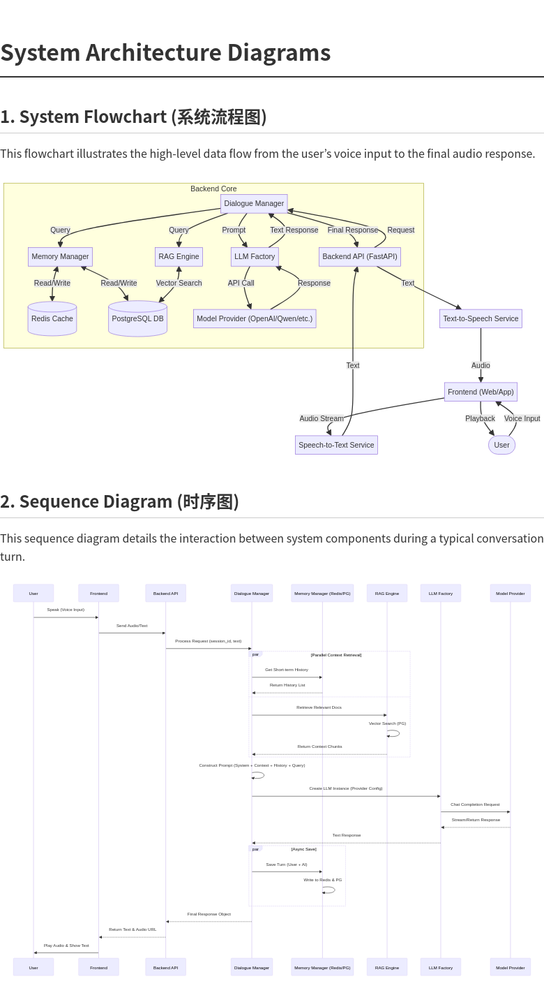
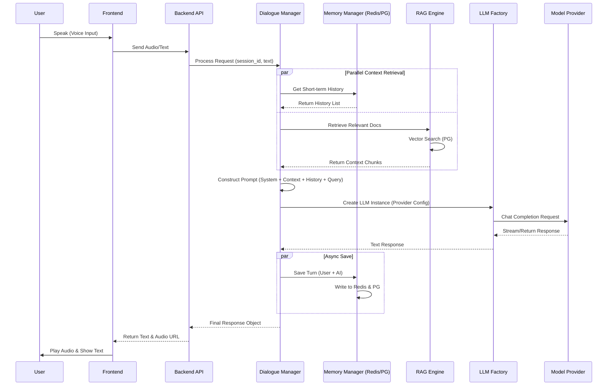

# AI Voice Solution (v2.1)

Product-level AI voice and semantic understanding system with Admin Dashboard, RAG, and Web Search.

## 🌟 New Features (v2.1)

*   **多租户架构 (Multi-Tenant Architecture)**: 基于 User ID 的全链路数据隔离，支持多用户独立使用。
*   **高级 RAG 引擎 (Advanced RAG Engine)**: 
    *   **索引模式**: 支持“高质量”（深度语义）与“经济”（关键词）两种模式。
    *   **混合检索**: 结合向量检索与全文检索，提升召回准确率。
    *   **重排序 (Rerank)**: 集成 Rerank 模型，支持自定义 Top-K 和相关度阈值。
*   **指令管理 (Instruction Management)**: 
    *   支持 Function Calling 定义的增删改查。
    *   支持 Excel 批量导入指令集。
    *   内置互斥逻辑校验。
*   **批量评测 (Batch Evaluation)**: 
    *   支持上传 Excel 测试用例。
    *   自动进行意图识别与关键词匹配测试。
    *   生成并下载详细的评测报告。
*   **聊天调试台 (Chat Debugger)**: 
    *   支持多会话管理（新建/切换/删除）。
    *   实时展示路由决策、耗时 (Latency) 和搜索源元数据。
    *   全链路 Trace ID 追踪。

## 🌟 New Features (v2.0)

*   **Admin Dashboard**: A Manus-style web interface for chat debugging, knowledge management, and batch evaluation.
*   **Traceability**: Full visibility into model routing, latency (TTFT), and search sources per message.
*   **Web Search**: Real-time internet access via DuckDuckGo (default), Tavily, or Serper.
*   **Batch Evaluation**: Automated testing via Excel upload with Pass/Fail metrics.
*   **Instruction Management**: Bulk import of instructions via Excel.

## 📚 最佳实践 (Best Practices)

我们整理了针对不同厂商（OpenAI, Deepseek, Qwen, Minimax 等）在指令解析、RAG 问答和通用闲聊场景下的**最佳模型组合推荐**。

👉 **[点击查看：LLM 选型最佳实践指南](docs/best_practices.md)**

---

## 🚀 Quick Start

### 1. Backend Setup

```bash
# Install dependencies
pip install -r requirements.txt

# Initialize Database
python app/db/init_db.py

# Start Server
uvicorn app.main:app --reload --host 0.0.0.0 --port 8001
```

### 2. Frontend Setup

```bash
cd frontend
npm install
npm run dev
```

Access the Admin Dashboard at `http://localhost:3000` (if started with port 3000) or `http://localhost:5173` (default).

## 📚 Documentation

*   [System Architecture](docs/architecture_diagrams.md)
*   [Best Practices for LLM Selection](docs/best_practices.md)
*   [Technical Design (v2.0)](docs/technical_design.md)

## 🛠 Configuration

Copy `.env.example` to `.env` and configure:

```env
# Web Search
SEARCH_PROVIDER=duckduckgo # or tavily, serper
TAVILY_API_KEY=...

# LLM Routing
INSTRUCTION_LLM_MODEL=gpt-4.1-mini
RAG_LLM_MODEL=gpt-4.1-mini
CHAT_LLM_MODEL=gpt-4.1-mini
```

## 📊 Batch Evaluation

Prepare an Excel file with columns: `case_id`, `query`, `expected_intent`, `expected_keywords`.
Upload it in the **Batch Eval** page to get a detailed report.

## 🏗 Architecture



### 核心调用时序 (Sequence Diagram)


