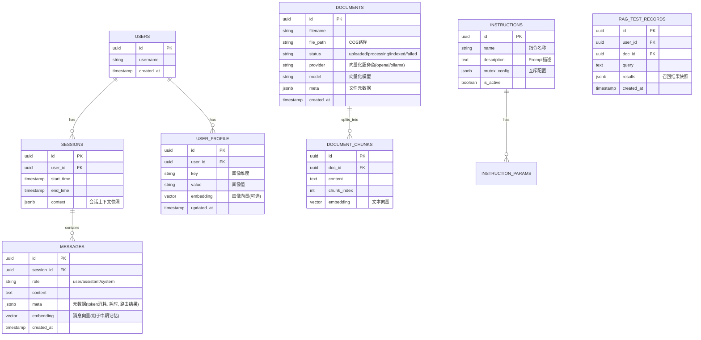
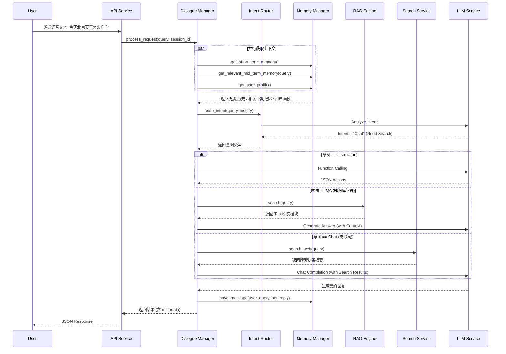
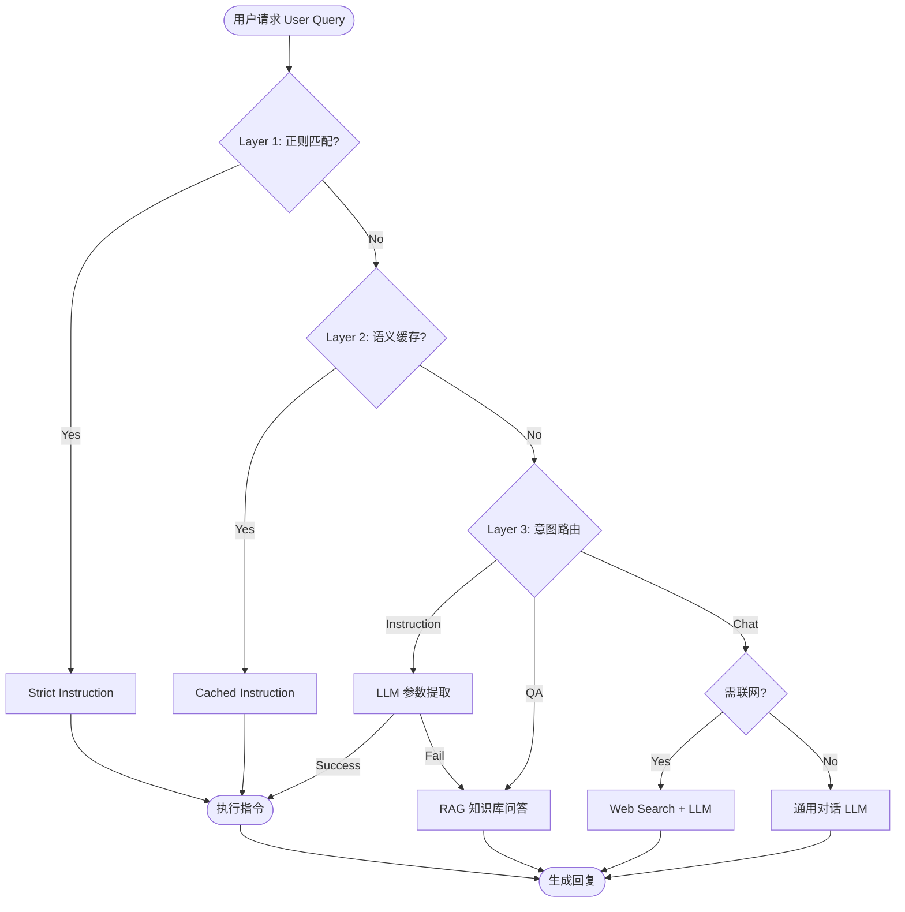

# AI语音语义理解模块 - 技术设计说明书

**版本**：v2.2
**日期**：2026-01-21
**作者**：Manus AI

---

## 1. 引言

### 1.1. 编写目的
本文档旨在为“AI语音语义理解模块”提供全面的技术设计规范，明确系统架构、数据结构、接口定义及核心业务流程。该文档将作为后续代码开发、测试及维护的基准依据。

**v2.2 更新摘要**：
*   **文档预览功能**：新增文档内容预览能力，支持 Markdown 渲染。
*   **多格式支持**：上传模块新增 `.docx`, `.xlsx`, `.pptx` 格式支持。
*   **API 优化**：文档列表接口性能优化（排除大字段），新增详情接口；增加空字节 (`\x00`) 自动清洗机制。
*   **交互优化**：失败记录禁用操作按钮，文件名增加预览链接。

**v2.1 更新摘要**：
*   **Ollama 深度集成**：优化向量化流程，引入 `langchain-ollama`，支持后端动态获取 Ollama 模型列表并同步至前端。
*   **文档索引机制明确**：确认索引操作采用“覆盖模式”，即重新索引时会先清空原有向量块。
*   **前端体验优化**：修复多语言 (i18n) 缺失、组件宽度抖动、弹窗交互等问题；优化上传失败后的列表刷新机制。
*   **依赖更新**：增加 `langchain-ollama` 支持，补充 `pypdf` 依赖。

**v2.0 更新摘要**：
*   新增 **管理后台 (Admin Dashboard)** 架构设计。
*   新增 **实时联网搜索 (Web Search)** 模块。
*   新增 **批量评测 (Batch Evaluation)** 与 **指令导入** 流程。
*   升级 **全链路可观测性 (Traceability)**，API 响应增加元数据透传。

### 1.2. 适用范围
本文档适用于后端开发人员、架构师、前端开发人员及测试人员。

---

## 2. 概要设计 (High-Level Design)

### 2.1. 系统架构图

系统采用分层架构设计，自上而下分为：接入层、业务逻辑层、数据持久层，并依赖外部大模型服务。

```mermaid
graph TD
    Client[客户端 (App/设备)] -->|HTTPS/WSS| Gateway[API 网关 (Nginx/Ingress)]
    AdminUI[管理后台 (Web)] -->|HTTPS| Gateway
    
    subgraph "应用服务层 (Application Layer)"
        API[API Service (FastAPI)]
        
        subgraph "核心模块 (Core Modules)"
            DM[对话管理器 (Dialogue Manager)]
            Router[意图路由 (Intent Router)]
            Executor[指令执行器 (Instruction Executor)]
            RAG[RAG 引擎 (RAG Engine)]
            Memory[记忆管理器 (Memory Manager)]
            Search[搜索服务 (Search Service)]
            Eval[评测服务 (Eval Service)]
        end
        
        API --> DM
        API --> Eval
        DM --> Memory
        DM --> Router
        Router -->|指令| Executor
        Router -->|问答| RAG
        Router -->|闲聊| Chat[通用对话]
        Chat --> Search
    end
    
    subgraph "数据持久层 (Data Layer)"
        Redis[(Redis Cache)]
        PG[(PostgreSQL + pgvector)]
        COS[对象存储 (COS)]
    end
    
    subgraph "外部依赖 (External Services)"
        LLM[大模型 API (OpenAI/Qwen/Minimax)]
        SearchAPI[搜索 API (DuckDuckGo/Tavily)]
        Ollama[Ollama Local Service]
    end
    
    Memory --> Redis
    Memory --> PG
    RAG --> PG
    RAG --> COS
    
    Router --> LLM
    Executor --> LLM
    RAG --> LLM
    Chat --> LLM
    Search --> SearchAPI
    RAG -.->|Embedding| Ollama
```

### 2.2. 模块职责划分

| 模块名称 | 核心职责 | 关键技术组件 |
| :--- | :--- | :--- |
| **API Service** | 处理HTTP/WebSocket请求，鉴权，参数校验，响应格式化。 | FastAPI, Pydantic, JWT |
| **Dialogue Manager** | 维护对话状态，协调各子模块调用顺序，处理异常和降级逻辑。 | State Machine, LangChain |
| **Intent Router** | 基于LLM判断用户意图（指令/问答/闲聊），分发请求。 | LLM Routing, Few-shot Prompting |
| **Instruction Executor** | 解析自然语言为结构化指令，处理参数补全和互斥检查。 | OpenAI Function Calling |
| **RAG Engine** | 文档解析、向量检索、重排序、生成答案。 | LangChain, Milvus/PGVector, BGE |
| **Vector Service** (New) | 公共向量服务，负责Embedding生成与通用向量检索，服务于Memory与RAG。 | OpenAI/Ollama (langchain-ollama), PGVector |
| **Memory Manager** | 管理短/中/长期记忆的读写、压缩和过期策略。负责中期记忆的向量化存储与相关性检索 (Memory RAG)。 | Redis, PGVector, Summary Chain |
| **Search Service** (New) | 封装外部搜索 API，提供实时信息查询能力。 | DuckDuckGo, Tavily, Serper |
| **Eval Service** (New) | 处理批量评测任务，解析 Excel，统计 Pass/Fail 指标。 | Pandas, OpenPyXL |

---

## 3. 详细设计 (Low-Level Design)

### 3.1. 数据库设计 (PostgreSQL)

采用PostgreSQL作为主数据库，利用 `pgvector` 插件存储向量数据。

#### 3.1.1. ER图 (Entity-Relationship Diagram)



### 3.2. Redis缓存设计
Redis主要用于存储高频访问的短期数据和分布式锁。

| Key Pattern | 类型 | TTL | 说明 |
| :--- | :--- | :--- | :--- |
| `session:{session_id}:history` | List | 30min | 短期记忆队列，存储最近10轮对话。`LPUSH/LTRIM` 维护长度。 |
| `session:{session_id}:state` | Hash | 30min | 当前会话状态机，字段如 `current_intent`, `slot_filling_status`。 |
| `user:{user_id}:lock` | String | 10s | 分布式锁，防止同一用户并发请求导致状态混乱。 |
| `cache:semantic:{query_hash}` | String | 24h | 语义缓存，存储高频问题的标准回答，减少LLM调用。 |
| `instruction_cache:{hash}` | String | Persistent | 确切指令缓存 (Exact Match)，用于存储用户点赞确认过的指令回复。 |

### 3.3. 泛化指令与反馈机制 (Generalized Instruction & Feedback)

针对系统的自学习与指令泛化能力，设计如下机制：

#### 3.3.1. 反馈存储策略 (Storage Strategy)
系统采用 **双层存储架构** 来平衡实时性与泛化能力：
1.  **精确匹配层 (Redis)**:
    *   **存储内容**: 用户明确“点赞”的 `Query -> Response` 对。
    *   **机制**: `FeedbackService` 将高频、确信的问答对存入 Redis。
    *   **优势**: 极速响应 (O(1))，无需 LLM 介入，保证 100% 一致性。
    *   **容量**: Redis Key 设置 TTL (如 7 天) 或依赖 LRU 淘汰策略，适合存储数百万级热点指令。
2.  **泛化模版层 (In-Memory)**:
    *   **存储内容**: 从 `BenchmarkCase` (系统/人工指令对) 提炼出的正则表达式模版 (`Regex Templates`)。
    *   **机制**: `InstructionMatcher` 服务启动时加载，并通过 `reload()` 接口支持热更新。
    *   **优势**: 支持参数槽位提取 (Slot Filling)，覆盖同一句式的多种变体。
    *   **容量**: 纯内存存储。以 10万条模版为例，内存占用仅约 50MB-100MB，单机足以支撑大规模泛化规则。

#### 3.3.2. 实时更新机制 (Real-time Updates)
为确保线上反馈即时生效：
*   **触发**: 当 `BenchmarkCase` 被创建、更新或删除（如通过“全局批量反馈”功能采纳指令）时。
*   **动作**: 自动触发 `InstructionMatcherService.reload()`。
*   **效果**: 内存中的正则模版库立即刷新，新生成的泛化规则对后续请求即刻生效。
*   **可见性**: 系统日志会打印当前加载的模版数量及详情 (`print_templates`)，便于运维排查。

#### 3.3.3. 泛化指令生成策略 (Generation Strategy)
利用 LLM 生成泛化指令对时，采用 **多风格覆盖策略** (v2.2 强化)：
*   **核心目标**: 模拟真实用户的多样化表达，特别是高频的短语指令。
*   **生成分布**:
    *   **直接短语 (Direct Short Commands)** (30-50%): 动词前置、极简风格 (如 "打开", "启动", "设置到5")。
    *   **关键词模式 (Keyword-style)**: 仅包含核心对象/参数 (如 "厨房灯", "音量10")。
    *   **自然口语 (Natural Spoken)**: 完整句子 (如 "我想把灯打开")。
    *   **礼貌/间接 (Polite)**: 包含敬语或委婉表达 (如 "麻烦帮我...", "能不能...")。
*   **实现**: 通过 `BenchmarkService` 的专用 Prompt 强制 LLM 输出上述分布的 JSON 数据。

---

### 3.4. API接口定义 (Interface Design)

遵循RESTful规范，所有接口前缀为 `/api/v1`。

#### 3.3.1. 核心对话接口 (Updated)

*   **URL**: `POST /chat/completions`
*   **描述**: 处理用户的语音转文本输入，返回语义理解结果（指令或回复）。
*   **Request Body**:
    ```json
    {
      "session_id": "uuid-string",
      "query": "帮我把微波炉开到大火，加热5分钟",
      "user_id": "user-123",
      "stream": false // 是否流式返回
    }
    ```
*   **Response Body (Success)**:
    ```json
    {
      "code": 0,
      "data": {
        "intent": "instruction", // instruction | qa | chat
        "reply": "好的，已为您开启大火模式，定时5分钟。",
        "actions": [ // 仅在 intent=instruction 时存在
          {
            "name": "start_cooking",
            "parameters": {
              "mode": "high",
              "duration": 300
            }
          }
        ],
        "metadata": { // v2.0 新增元数据
          "trace_id": "uuid...",
          "route": "instruction",
          "latency_ms": 850,
          "models_used": {
            "router": "minimax-m2",
            "executor": "gpt-4o"
          },
          "search_results": [] // 如果触发搜索，此处包含来源链接
        }
      }
    }
    ```

#### 3.3.2. 批量评测接口 (New)

*   **URL**: `POST /admin/eval/batch`
*   **描述**: 上传 Excel 文件进行批量评测。
*   **Content-Type**: `multipart/form-data`
*   **Parameters**: `file` (Excel)
*   **Excel 格式要求**:
    *   `case_id`: 用例编号
    *   `query`: 用户提问
    *   `expected_intent`: 期望意图 (instruction/qa/chat)
    *   `expected_keywords`: 期望回复中包含的关键词 (逗号分隔)
*   **Response**: 返回包含评测结果（Pass/Fail, 耗时, 实际回复）的 Excel 文件流。

#### 3.3.3. 指令导入接口 (New)

*   **URL**: `POST /admin/instructions/import`
*   **描述**: 批量导入指令定义。
*   **Excel 格式要求**:
    *   `name`: 指令名称 (如 `set_fire`)
    *   `description`: 指令描述
    *   `parameters`: JSON 格式的参数定义
    *   `mutex_group`: 互斥组名称

---

### 3.4. 核心业务流程 (Sequence Diagrams)

#### 3.4.1. 语音指令处理流程 (含动态降级与搜索)



### 3.5. 记忆系统设计 (Memory System)
记忆系统分为三级存储架构，旨在平衡Token成本与上下文完整性。

#### 3.5.1. 向量服务 (Vector Service)
为了统一管理向量化操作，系统引入了独立的 `Vector Service` 模块，为 `Memory Manager` 和 `RAG Engine` 提供底层支持。
*   **职责**:
    1.  **Embedding Generation**: 基于配置（OpenAI/Azure/HuggingFace）生成文本向量。
    2.  **Vector Search**: 提供通用的数据库向量检索接口，支持过滤与排序。
*   **配置项**: `EMBEDDING_PROVIDER`, `EMBEDDING_MODEL` 等。
*   **Ollama 集成优化 (v2.1)**: 
    *   使用 `langchain-ollama` 替代旧版 `langchain-community`，提高兼容性。
    *   支持动态获取 Ollama 服务端可用模型列表 (Proxy Endpoint: `/admin/ollama/models`)，确保前端配置与后端服务一致。

#### 3.5.2. 短期记忆 (Short-term Memory)
*   **存储介质**: Redis List
*   **策略**: 滑动窗口，保留最近 N 轮对话（默认 10-20 条）。
*   **用途**: 维持当前对话的连贯性，支持多轮追问。

#### 3.5.3. 中期记忆 (Mid-term Memory)
*   **存储介质**: PostgreSQL (`messages` table with `pgvector`)
*   **策略**: 全量持久化存储。
*   **检索机制 (Memory RAG)**:
    1.  **向量化**: 对每条消息生成 Embedding (OpenAI/Mock) 并存入向量列。
    2.  **相关性检索**: 在每轮对话时，将用户 Query 向量化，在数据库中搜索余弦相似度最高的 K 条历史消息。
    3.  **去重**: 检索结果需排除已存在于短期记忆中的最近消息。
    4.  **上下文注入**: 将检索到的相关中期记忆作为 "Relevant Past Conversation" 注入 System Prompt。
*   **优势**: 能够跨越长周期召回关键信息，同时避免将所有历史记录塞入 Context Window，大幅节省 Token。

#### 3.5.4. 长期记忆 (Long-term Memory)
*   **存储介质**: PostgreSQL (`user_profile` table)
*   **策略**: 结构化画像存储。
*   **用途**: 存储用户的静态属性（如昵称）和动态偏好（如“喜欢辣”、“家里有微波炉”）。通过专门的画像提取 Chain 更新。

### 3.6. RAG 服务增强设计 (RAG Service Enhancements)
为了提升知识检索的准确性和灵活性，RAG 模块进行了多维度的增强。

#### 3.6.1. 配置分级策略
系统采用“默认配置 + 用户个性化配置”的分级策略：
1.  **系统默认配置 (Environment/Config)**: 在 `.env` 和 `config.py` 中定义全局默认参数（如 `RAG_CHUNK_SIZE`, `RAG_TOP_K`, `RAG_RETRIEVAL_MODE`）。这作为兜底策略，也用于中期记忆检索的默认行为。
2.  **用户个性化配置 (User Config)**: 用户可在“知识库”界面自定义 RAG 参数（如 检索模式、Top K、重排序开关）。
3.  **优先级**: 用户配置 > 系统默认配置。若用户未配置，则自动回退使用系统默认值。

#### 3.6.2. 混合检索与重排序 (Hybrid Search & Reranking)
单一的向量检索在匹配专有名词或精确关键词时存在短板，因此引入混合检索架构。

*   **检索流程**:
    1.  **向量检索 (Vector Search)**: 使用 Embedding 模型 (OpenAI/Ollama) 将 Query 向量化，通过 Cosine Distance 召回语义相关的 Top-N 文档块。
    2.  **关键词检索 (Keyword Search)**: 使用数据库全文索引 (如 PostgreSQL `tsvector` 或简单的 `ILIKE` 模糊匹配) 召回包含精确关键词的 Top-N 文档块。
    3.  **混合 (Hybrid)**: 将两路召回结果合并并去重。
    4.  **重排序 (Reranking)**: (可选) 使用专门的 Rerank 模型 (如 `bce-reranker-base_v1`) 或 RRF (Reciprocal Rank Fusion) 算法对合并后的结果进行二次打分排序，最终选取 Top-K 返回。

#### 3.6.3. 向量服务扩展与模型适配
`Vector Service` 已扩展支持多厂商、多维度的向量模型，以适应不同场景下的精度与性能需求。

*   **配置管理**:
    *   **静态配置**: 前端维护一份 `embeddingModels.json` 配置文件，定义了主流厂商 (OpenAI, Azure, Qwen, Zhipu, Qianfan, Google 等) 的常用 Embedding 模型及其参数（如维度、描述）。
    *   **动态获取**: 针对 Ollama 本地模型，系统通过 API 动态获取列表，并结合静态配置中的关键词规则（如过滤包含 "embed" 的模型）进行智能筛选，仅展示适用的向量模型。
*   **支持 Provider**:
    *   `OpenAI/Azure`: 标准云端方案 (text-embedding-3-small/large, ada-002)。
    *   `Ollama`: 本地私有化方案，支持 bge-m3, nomic-embed-text 等。
    *   `Zhipu/Qianfan/Qwen`: 国内大模型厂商支持。

#### 3.6.4. 文档处理工作流 (Document Processing Workflow)
系统支持文档的“上传”与“索引”解耦，并允许为每个文档指定索引模型。

1.  **上传 (Upload)**: 用户上传文档 (PDF/TXT/MD)，系统仅解析文本内容并保存至数据库，状态为 `uploaded`。
2.  **手动索引 (Manual Indexing)**:
    *   用户在管理后台选择目标文档，点击“索引”。
    *   **模型选择**: 弹窗加载 `embeddingModels.json` 及 Ollama 列表，用户可选择特定的 Provider 和 Model（界面提示模型维度，如 1536/1024/768）。

### 3.7. 指令泛化与匹配架构 (Instruction Generalization & Matching)

为了解决传统正则匹配僵化和LLM调用成本高的问题，系统引入了“指令泛化”与“三级匹配”架构，实现高精度、低延迟与强泛化能力的平衡。

#### 3.7.1. 核心处理流程 (Core Processing Flow)
系统处理用户请求的核心链路如下，体现了从“低成本匹配”到“深层语义理解”的降级过程：



#### 3.7.2. 三级匹配策略 (3-Layer Matching Strategy)
系统按顺序执行三级匹配，一旦命中即返回结果：

1.  **Layer 1: 严格正则匹配 (Strict Matcher)**
    *   **机制**: 基于内存中加载的 `Instruction` 对象及其预编译的 Regex 模板进行匹配。
    *   **优势**: 极低延迟 (<10ms)，100% 准确率。
    *   **来源**: 由“泛化指令对”生成的正则表达式（如 `把(设备名称)打开`）。
2.  **Layer 2: 语义缓存匹配 (Cache Matcher)**
    *   **机制**: 查询 Redis 中的 `Instruction Cache`。
    *   **键值设计**: Key 为 Query 的哈希值，Value 为之前成功执行的指令 JSON。
    *   **优势**: 避免对相同高频指令重复调用 LLM，降低成本与延迟。
3.  **Layer 3: LLM 语义意图识别 (Semantic Matcher)**
    *   **机制**: 调用 LLM (Intent Router) 进行意图分类与参数提取。
    *   **降级**: 若 LLM 识别为 Instruction 但参数提取失败，可自动降级为 RAG 或 Web Search。

#### 3.7.2. 指令泛化机制 (Generalized Instruction Pairs)
传统的“指令-正则”通过人工编写，难以覆盖用户多样的表达方式。本系统采用 LLM 辅助生成的“泛化指令对”机制。

*   **生成流程**:
    1.  **定义**: 用户仅需定义核心指令及其参数结构（如 `set_volume(level)`）。
    2.  **LLM 扩充**: 系统调用 LLM 生成数十种自然语言表达（如“声音大点”、“调到静音”、“最大声”）。
    3.  **版本控制**: 每次生成作为一个 Version，用户可预览并指定“Active Version”。
    4.  **应用**: 系统将 Active Version 中的问答对转化为 Regex 模板，加载至 Layer 1 Matcher。
*   **优势**: 
    *   **零人工成本**: 自动覆盖倒装、省略、口语化表达。
    *   **参数注入**: 支持嵌套 JSON 参数的自动提取与注入（如 `{"device": {"name": "light"}}`）。

#### 3.7.3. 自适应反馈闭环 (Adaptive Feedback Loop)
系统通过用户反馈不断优化匹配准确率。

*   **反馈来源**: 
    *   **单条反馈**: 用户在聊天界面对回复点赞/点踩。
    *   **批量反馈**: 管理员在“全局反馈”界面批量审查历史对话。
*   **学习机制**:
    *   **正向反馈**: 将 Query-Intent-Response 对存入“系统指令对 (System Pairs)”库。
    *   **去重策略**: 
        *   **Redis 去重**: 过滤完全相同的 Query 字符串。
        *   **模板去重**: 过滤已被现有 Regex 模板覆盖的 Query，避免冗余。

    *   **覆盖机制 (Overwrite Strategy)**: 强制清空旧分块，执行 Split -> Embedding (使用选定模型) -> Store。
3.  **维度存储策略 (Vector Storage Strategy)**:
    *   数据库底层的 `embedding` 列采用灵活维度设计 (`Vector()`)，不再硬编码为 1536。
    *   这使得同一张表可以同时存储来自 OpenAI (1536维)、Ollama/Nomic (768维)、Zhipu (1024维) 等不同模型的向量数据，为“多模型共存”打下基础。

#### 3.6.5. 多路召回与 RRF 融合 (Multi-Path Retrieval & RRF Fusion)
针对知识库中可能同时存在多种向量模型（例如旧文档使用 OpenAI，新文档使用 Ollama）的情况，系统摒弃了传统的“强制统一模型”或“重索引”方案，采用了先进的 **多路召回 (Multi-Path Retrieval)** 策略，实现“上传即忘、全库召回”。

*   **核心痛点**:
    *   不同 Embedding 模型的向量空间不兼容，维度不同（如 1536 vs 1024）无法直接计算相似度。
    *   传统的“一对一”匹配会导致用户切换模型后无法检索到旧文档。

*   **解决方案流程**:
    1.  **自动感知 (Auto-Detection)**: 系统在检索前，会自动扫描当前用户的文档库，识别出所有活跃的 `(provider, model)` 组合（例如：`[("openai", "text-embedding-3-small"), ("ollama", "nomic-embed-text")]`）。
    2.  **并行多路搜索 (Parallel Multi-Path Search)**:
        *   系统针对每一个活跃模型，分别调用对应的 Embedding API 生成 Query 向量。
        *   **并发执行**多路向量检索：Query Vector A 仅在数据库中检索 provider=A 的文档；Query Vector B 检索 provider=B 的文档。
    3.  **RRF 排名融合 (Reciprocal Rank Fusion)**:
        *   由于不同模型的余弦相似度分数分布不同（例如模型 A 的 0.8 可能相当于模型 B 的 0.6），直接按分数排序是不公平的。
        *   系统引入 **RRF 算法**，基于“排名”而非“绝对分数”进行融合。
        *   **公式**: $Score(d) = \sum \frac{1}{k + rank(d)}$ (其中 $k$ 常取 60)。
        *   该算法能有效平滑不同模型的差异，确保各路召回的 Top 结果都能在最终列表中得到合理展示。

#### 3.6.6. RAG 召回测试与历史记录 (Recall Testing)
为了便于调优 RAG 效果，系统提供了可视化的召回测试工具：
*   **文档级测试**: 支持针对特定文档进行召回测试，测试记录 (RAGTestRecord) 绑定至文档 ID。
*   **历史回溯**: 每次测试的 Query、召回结果 (包含 Score 和 Chunk Content) 均会被持久化存储。
*   **交互界面**: 前端提供独立的测试视图，支持左侧历史记录列表与右侧详情展示的联动，并具备自适应布局与返回导航功能。

#### 3.6.7. Ollama 向量化嵌入实现详解 (Ollama Vectorization Implementation)
针对本地 Ollama 服务在处理大规模向量化任务时可能遇到的性能瓶颈与超时问题，系统在 `RAG Engine` 层面实现了深度优化的向量化流程。

1.  **智能分块策略 (Smart Chunking Strategy)**
    *   **背景**: 许多高性能的开源 Embedding 模型（如 `bge-large`, `bert-base`）通常具有较小的上下文窗口限制（通常为 512 Tokens）。若分块过大，会导致 Ollama 返回 500 错误或静默截断。
    *   **策略**: 系统根据选择的模型名称进行动态判断。
        *   **通用模型**: 默认使用 `RAG_CHUNK_SIZE=1000`。
        *   **短窗口模型**: 若模型名包含 `bge` 或 `bert`，自动将 `chunk_size` 降级调整为 **500 字符**。
    *   **优势**: 确保分块内容始终在模型的有效感受野内，最大化语义完整性并避免服务报错。

2.  **批次处理机制 (Batch Processing)**
    *   **问题**: 对于长文档（如几十万字的书籍），一次性请求嵌入会导致 HTTP 请求体过大或 Ollama 服务处理超时。
    *   **方案**: 引入批处理机制，将切分后的 Chunks 按 **Batch Size = 10** 分组。
    *   **流程**: 每次仅向 Ollama 发送 10 个文本段，等待返回后再处理下一组。这有效降低了本地服务的瞬时负载。

3.  **增量提交与事务管理 (Incremental Commit)**
    *   **传统痛点**: 只有当整个文档全部处理完成后才一次性 Commit。若中途发生网络抖动或超时，所有进度将丢失，且长事务会占用数据库大量资源。
    *   **优化**: 采用“分批提交”模式。
        *   每处理完一个 Batch（10个分块），立即将生成的 `DocumentChunk` 写入数据库并执行 `commit()`。
        *   配合 **全局索引 (Global Indexing)** 逻辑，即使分批写入，也能保证 `chunk_index` 的连续性和正确性。
    *   **收益**: 
        *   支持断点续传（逻辑上），避免“功亏一篑”。
        *   用户可在前端实时观测到索引进度的增长。
        *   彻底解决了大事务导致的数据库锁等待与超时问题。

### 3.7. 指令理解核心架构与自适应演进 (Instruction Understanding Core & Adaptive Evolution)

本章节详细阐述指令理解模块的**三层匹配架构**及**自适应闭环**机制。系统通过“本地正则-Redis缓存-LLM兜底”的三级漏斗设计，在保证极高响应速度的同时，兼顾了泛化能力与长尾覆盖。

#### 3.7.1. 三层指令匹配架构 (Three-Layer Matching Architecture)

为了在毫秒级延迟下实现高精度的指令解析，系统设计了优先级递减的三层匹配逻辑：

1.  **第一层：本地内存正则匹配 (L1: Local Memory Regex Matching)**
    *   **定位**: 极速层，处理高频、有规律的变体指令。
    *   **实现原理**:
        *   系统启动时，加载当前**活跃版本 (Active Version)** 的“泛化指令对”至内存。
        *   **正则生成逻辑**:
            1.  **参数提取**: 遍历指令对应的 JSON 参数值 (Values)。
            2.  **反向定位**: 在 Query 字符串中查找这些参数值的出现位置。
            3.  **正则构建**: 将 Query 中的参数值替换为命名捕获组 `(?P<param_name>.+?)`，将剩余的静态文本进行 `re.escape` 处理，最终拼接为完整的正则表达式。
            4.  **类型约束**: 根据参数定义（如 Number, Enum），在正则中通过预定义的 Pattern（如 `\d+`）替换通用的 `.+?`，提高匹配精度。
            5.  **示例**:
                *   指令: `{"action": "set_volume", "value": 50}`
                *   Query: "把音量调到50"
                *   生成正则: `^把音量调到(?P<value>\d+)$`
    *   **匹配流程**: 遍历内存中的正则列表，一旦 Match 成功，直接提取捕获组内容填入 JSON 模版，**耗时 < 1ms**，无需网络 IO。
    *   **去重机制**: 在生成正则模版时，会检查内存中是否已存在相同的 Pattern，避免冗余规则。

2.  **第二层：Redis 精确缓存匹配 (L2: Redis Exact Caching)**
    *   **定位**: 高速层，处理用户历史产生的高频固定问法。
    *   **实现原理**:
        *   Key: `cache:instruction:{repo_id}:{query_string}`
        *   Value: 完整的 JSON Response。
    *   **匹配流程**:
        *   若 L1 未命中，对 Query 进行标准化处理后查询 Redis。
        *   **耗时 ~5-10ms**。
    *   **去重机制**: 在写入缓存前，使用 `EXISTS` 命令检查 Key 是否存在，避免重复写入。

3.  **第三层：LLM 语义兜底 (L3: LLM Semantic Fallback)**
    *   **定位**: 智能层，处理从未见过的新奇问法或复杂长难句。
    *   **实现原理**:
        *   构建包含指令定义的 Prompt，调用大模型 (Instruction LLM) 进行 Few-shot 推理。
    *   **匹配流程**:
        *   若 L1, L2 均未命中，则调用 LLM。
        *   **耗时 ~1-2s** (取决于模型与网络)。
    *   **自适应入口**: LLM 解析成功后的结果，是系统“学习”和“进化”的重要来源。

#### 3.7.2. 泛化指令对生成与版本控制 (Generalized Pairs Generation & Versioning)

为了主动提升 L1 层的覆盖率，系统引入了**泛化指令对 (Generalized Instruction Pairs)** 生成机制（原“系统指令对”）。

1.  **生成策略 (Generation Strategy)**:
    *   **逐条生成 (Per-Instruction Generation)**: 摒弃了粗糙的批量生成，系统针对指令库中的每一条指令单独构建 Prompt。
    *   **多样性增强**: Prompt 显式要求 LLM 生成：
        *   极简短语 (如“打开空调”)
        *   口语化表达 (如“帮我把空调打开呗”)
        *   带礼貌用语的变体 (如“请...”, “麻烦...”)
    *   **可配置性**: 支持在前端弹窗中配置生成使用的模型厂商 (Qwen, Minimax, Baidu 等)、模型版本及每条指令生成的数量 (默认 3-5 条)。

2.  **版本控制 (Version Control)**:
    *   **多版本共存**: 每次生成操作都会产生一个新的 `version` 号（递增）。
    *   **活跃版本 (Active Version)**: 指令库维护一个 `active_system_version` 指针。只有被标记为 Active 的版本的指令对，才会被加载到 L1 内存正则层。
    *   **版本轮替与清理**: 系统保留最新的 **5个版本**，自动清理更早的过期版本，防止数据库膨胀。

#### 3.7.3. 自适应反馈闭环 (Adaptive Feedback Loop)

系统通过用户的显式反馈，不断将 L3 (LLM) 的推理成果固化为 L1 (正则) 或 L2 (Redis) 的能力。

1.  **触发机制**:
    *   用户对助手回复点击 **“点赞 (Like)”** 或在 **“批量反馈”** 页面进行确认。
    *   或者通过 **“召回测试”** 验证通过的 Case。

2.  **学习路径**:
    *   **路径 A (入库 Redis)**: 用户确认的 (Query, JSON) 对直接写入 Redis 缓存，即时生效（L2 能力增强）。
    *   **路径 B (泛化入库)**: 
        *   后台尝试将 Query 泛化为正则模版。
        *   若泛化成功（识别出动态参数），则作为新的“泛化指令对”存入数据库，并标记为手动来源。
        *   **去重校验**: 在入库前，同时进行 **Redis Key 校验** (字符串级去重) 和 **内存正则校验** (模版级去重)，确保知识库的纯净。

3.  **闭环效果**:
    *   随着用户使用频率增加，L1 和 L2 的命中率逐渐上升，L3 的调用率下降。
    *   系统响应速度越来越快，成本越来越低，实现“越用越聪明”。

---

---

### 3.8. 多语言支持设计 (Multilingual Support Design)

响应国际化需求，系统在 v2.x 版本引入多语言支持架构。首期优先支持 **英文 (English)**，并预留其他语种的扩展能力。设计遵循“最小侵入性”原则，在保持现有核心链路不变的前提下，通过配置驱动实现语种适配。

#### 3.8.1. 设计原则 (Design Principles)
1.  **架构微调**: 保持 `API -> DM -> Router -> Executor` 主链路不变，仅在关键节点注入语种上下文。
2.  **模型优选**: 针对不同语种，动态调度该语种表现最佳的模型（如中文倾向 Minimax/Qwen，英文倾向 GPT-4o/Llama3/DeepSeek）。
3.  **配置驱动**: 语种属性下沉至 `Session` 维度，作为会话的元数据流转全链路。

#### 3.8.2. 会话配置增强 (Session Configuration)
会话（Session）是多语言切换的锚点。

1.  **新增配置项**:
    *   在会话创建/编辑的 `llm_config` 中新增 `LANGUAGE` 字段 (Enum: `zh`, `en`, ...)。
    *   默认值: `zh` (保持向下兼容)。

2.  **指令库语种校验 (Repo Validation)**:
    *   **场景**: 用户在创建英文会话时，可能会错误选择一个纯中文的指令库。
    *   **机制**:
        *   为 `InstructionRepo` 增加 `language` 属性。
        *   **轻量级二次确认**: 当 `Session.language != Repo.language` 时，前端在“保存/应用”按钮处触发轻量级交互（如 `Popconfirm` 气泡确认框或 `Tooltip` 警示），提示“语种不匹配，可能影响识别准确率”，**避免使用阻断式的模态弹窗 (Modal)**，确保交互的流畅性。

#### 3.8.3. 模型适配策略 (Model Adaptation)

系统不再维护复杂的动态模型映射表，而是充分利用现有的会话配置能力，结合环境变量默认值来实现模型适配。

*   **会话级手动配置 (Session Override)**:
    *   用户在创建/编辑会话时，本身即可为该会话单独指定 Intent/Instruction/Chat/RAG 各个阶段使用的 Provider 和 Model。
    *   **策略**: 依赖用户的显式配置。如果用户为英文会话选择了 GPT-4o，则系统直接使用该配置。

*   **环境变量默认值 (Env Defaults)**:
    *   当用户未在会话中指定模型（即使用“默认”）时，系统将读取环境变量中的默认配置。
    *   **改进点**: `.env` 配置文件将区分语种默认值，例如：
        ```bash
        # Default Models (Implicitly Chinese)
        DEFAULT_INTENT_MODEL=minimax-text-01
        DEFAULT_INSTRUCTION_MODEL=qwen-max
        
        # Default Models for English (en)
        DEFAULT_INTENT_MODEL_EN=gpt-3.5-turbo
        DEFAULT_INSTRUCTION_MODEL_EN=gpt-4o
        ```
    *   **运行时逻辑**: 若 Session 配置为空，系统根据 Session 的 `LANGUAGE` 字段回退到对应的 `DEFAULT_*` (中文) 或 `DEFAULT_*_EN` (英文) 环境变量。

#### 3.8.4. 链路适配 (Pipeline Adaptation)
核心处理链路需针对语种进行以下微调：

1.  **意图识别 (Intent Recognition)**:
    *   Prompt 模板国际化：根据 Session 语种加载对应的 System Prompt（如 `INTENT_PROMPT_EN` vs `INTENT_PROMPT_ZH`），确保 LLM 理解任务描述。
2.  **检索增强 (RAG)**:
    *   **文档索引 (Document Indexing)**:
        *   **新增配置**: 在知识库文档列表的“索引”弹窗中，增加**语种 (Language)** 配置项。
        *   **目的**: 标记该文档所属的语言环境（如 `zh` 或 `en`），Provider/Model 仍保持手动配置。
    *   **检索过滤 (Retrieval Filtering)**:
        *   **逻辑**: 当开启 RAG 时，系统根据当前会话的 `LANGUAGE` 属性，仅检索对应语种的文档。
        *   **优势**: 避免跨语言干扰（如英文 Query 召回中文文档），提高相关性。
    *   **Embedding/Rerank**: 推荐配置多语言通用的模型 (如 `text-embedding-3-small`, `bge-m3`)。
3.  **TTS/ASR (如涉及)**:
    *   根据语种代码 (`zh-CN`, `en-US`) 自动切换语音合成与识别引擎的 Locale 参数。

## 4. 附录

### 4.1. 第三方库选型
*   **Web Framework**: FastAPI (高性能异步框架)
*   **ORM**: SQLAlchemy + asyncpg (异步数据库驱动)
*   **LLM SDK**: LangChain (v0.1.0+)
*   **Ollama Support**: langchain-ollama (用于 Ollama Embeddings, v2.1新增)
*   **Document Parsing**: pypdf (PDF 解析)
*   **Vector DB Client**: pymilvus / psycopg2-binary
*   **Search**: duckduckgo-search / tavily-python

### 4.2. 配置项说明
*   `SEARCH_PROVIDER`: string - 搜索服务提供商 (duckduckgo/tavily/serper)
*   `INSTRUCTION_LLM_MODEL`: string - 指令解析专用模型
*   `RAG_LLM_MODEL`: string - RAG 问答专用模型
*   `CHAT_LLM_MODEL`: string - 通用闲聊模型
*   `OLLAMA_API_BASE`: string - Ollama 服务地址 (默认 `http://localhost:11434`)

### 4.3. 模型选型参考与性能基准 (Model Benchmarks & Recommendations)

#### 4.3.1. 推荐模型配置 (2026-01-27 Update)
基于最新的性能评测与连通性测试，以下是各场景下的最佳模型配置建议：

**A. 中文环境 (Chinese Context)**

| 场景 (Scenario) | 推荐模型 (Primary) | 备选模型 (Secondary) | 理由 (Rationale) |
| :--- | :--- | :--- | :--- |
| **意图分类 (Intent)** | **Minimax Text-01** | Qwen Flash / ERNIE Tiny | Minimax 拥有极致的响应速度 (~450ms)，是降低首字延迟的关键。 |
| **语音指令 (Instruction)** | **Minimax ABAB 6.5s** | Qwen Plus / ERNIE Lite | ABAB 6.5s 兼顾了解析准确度与速度 (~1.9s)；M2.1 因格式问题暂不推荐。 |
| **闲聊对话 (Chat)** | **Minimax ABAB 6.5s** | Qwen Flash / ERNIE Lite | 响应迅速 (~850ms TTFT)，且能够提供自然流畅的对话体验。 |
| **实时搜索 (Search)** | **Qwen Flash** | ERNIE Speed | 搜索场景下 Qwen 的综合表现（速度+总结能力）最为均衡。 |

**B. 英文环境 (English Context - First Draft)**

| 场景 (Scenario) | 推荐模型 (Primary) | 备选模型 (Secondary) | 理由 (Rationale) |
| :--- | :--- | :--- | :--- |
| **意图分类 (Intent)** | **GPT-3.5 Turbo** | DeepSeek-V3 / Llama-3-8b | 响应速度快，指令遵循能力足以处理意图路由任务。 |
| **语音指令 (Instruction)** | **GPT-4o** | Claude 3.5 Sonnet | 复杂 JSON 结构提取能力最强，对英文指令的细微差别理解最准确。 |
| **闲聊对话 (Chat)** | **GPT-4o-mini** | Llama-3-70b | 性价比极高，响应速度快，且具备优秀的英文对话能力。 |
| **实时搜索 (Search)** | **GPT-4o-mini** | Perplexity Sonar | 能够快速处理搜索结果并生成简洁的英文摘要。 |

#### 4.3.2. 国内主流模型参考链接
*   **Minimax (海螺)**: [模型介绍](https://platform.minimaxi.com/docs/guides/models-intro) - 语音交互首选，速度极快。
*   **Qwen (通义千问)**: [模型列表](https://bailian.console.aliyun.com/cn-beijing/?tab=doc#/doc/?type=model&url=2840914) - 性能最均衡，稳定性高。
*   **Deepseek (深度求索)**: [价格与API](https://api-docs.deepseek.com/zh-cn/quick_start/pricing) - 推理能力强，适合复杂任务 (Deepseek-R1)。
*   **Zhipu (智谱 GLM)**: [定价体系](https://open.bigmodel.cn/pricing) - GLM-4 系列在国内有广泛应用。
*   **Baidu (百度千帆)**: [模型概览](https://cloud.baidu.com/doc/qianfan/s/rmh4stp0j) - 推荐使用 Tiny/Lite/Speed 系列以获得更佳的 API 响应速度。

### 4.4 参考技术文档

*   [RAG分块策略：主流方法（递归、jina-seg）+前沿推荐（Meta-chunking、Late chunking、SLM-SFT）](https://developer.aliyun.com/article/1644822)
*   [提示词优化工具github](https://github.com/linshenkx/prompt-optimizer)、[提示词优化工具在线](https://prompt.always200.com/#/basic/system)