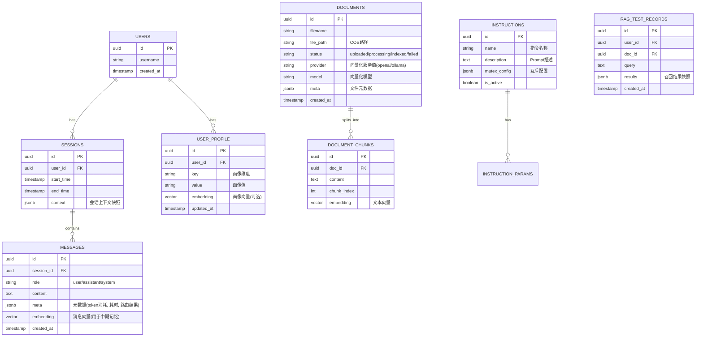
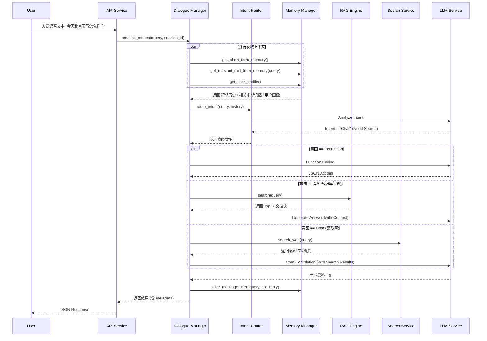

# AI语音语义理解模块 - 技术设计说明书

**版本**：v2.2
**日期**：2026-01-21
**作者**：Manus AI

---

## 1. 引言

### 1.1. 编写目的
本文档旨在为“AI语音语义理解模块”提供全面的技术设计规范，明确系统架构、数据结构、接口定义及核心业务流程。该文档将作为后续代码开发、测试及维护的基准依据。

**v2.2 更新摘要**：
*   **文档预览功能**：新增文档内容预览能力，支持 Markdown 渲染。
*   **多格式支持**：上传模块新增 `.docx`, `.xlsx`, `.pptx` 格式支持。
*   **API 优化**：文档列表接口性能优化（排除大字段），新增详情接口；增加空字节 (`\x00`) 自动清洗机制。
*   **交互优化**：失败记录禁用操作按钮，文件名增加预览链接。

**v2.1 更新摘要**：
*   **Ollama 深度集成**：优化向量化流程，引入 `langchain-ollama`，支持后端动态获取 Ollama 模型列表并同步至前端。
*   **文档索引机制明确**：确认索引操作采用“覆盖模式”，即重新索引时会先清空原有向量块。
*   **前端体验优化**：修复多语言 (i18n) 缺失、组件宽度抖动、弹窗交互等问题；优化上传失败后的列表刷新机制。
*   **依赖更新**：增加 `langchain-ollama` 支持，补充 `pypdf` 依赖。

**v2.0 更新摘要**：
*   新增 **管理后台 (Admin Dashboard)** 架构设计。
*   新增 **实时联网搜索 (Web Search)** 模块。
*   新增 **批量评测 (Batch Evaluation)** 与 **指令导入** 流程。
*   升级 **全链路可观测性 (Traceability)**，API 响应增加元数据透传。

### 1.2. 适用范围
本文档适用于后端开发人员、架构师、前端开发人员及测试人员。

---

## 2. 概要设计 (High-Level Design)

### 2.1. 系统架构图

系统采用分层架构设计，自上而下分为：接入层、业务逻辑层、数据持久层，并依赖外部大模型服务。

```mermaid
graph TD
    Client[客户端 (App/设备)] -->|HTTPS/WSS| Gateway[API 网关 (Nginx/Ingress)]
    AdminUI[管理后台 (Web)] -->|HTTPS| Gateway
    
    subgraph "应用服务层 (Application Layer)"
        API[API Service (FastAPI)]
        
        subgraph "核心模块 (Core Modules)"
            DM[对话管理器 (Dialogue Manager)]
            Router[意图路由 (Intent Router)]
            Executor[指令执行器 (Instruction Executor)]
            RAG[RAG 引擎 (RAG Engine)]
            Memory[记忆管理器 (Memory Manager)]
            Search[搜索服务 (Search Service)]
            Eval[评测服务 (Eval Service)]
        end
        
        API --> DM
        API --> Eval
        DM --> Memory
        DM --> Router
        Router -->|指令| Executor
        Router -->|问答| RAG
        Router -->|闲聊| Chat[通用对话]
        Chat --> Search
    end
    
    subgraph "数据持久层 (Data Layer)"
        Redis[(Redis Cache)]
        PG[(PostgreSQL + pgvector)]
        COS[对象存储 (COS)]
    end
    
    subgraph "外部依赖 (External Services)"
        LLM[大模型 API (OpenAI/Qwen/Minimax)]
        SearchAPI[搜索 API (DuckDuckGo/Tavily)]
        Ollama[Ollama Local Service]
    end
    
    Memory --> Redis
    Memory --> PG
    RAG --> PG
    RAG --> COS
    
    Router --> LLM
    Executor --> LLM
    RAG --> LLM
    Chat --> LLM
    Search --> SearchAPI
    RAG -.->|Embedding| Ollama
```

### 2.2. 模块职责划分

| 模块名称 | 核心职责 | 关键技术组件 |
| :--- | :--- | :--- |
| **API Service** | 处理HTTP/WebSocket请求，鉴权，参数校验，响应格式化。 | FastAPI, Pydantic, JWT |
| **Dialogue Manager** | 维护对话状态，协调各子模块调用顺序，处理异常和降级逻辑。 | State Machine, LangChain |
| **Intent Router** | 基于LLM判断用户意图（指令/问答/闲聊），分发请求。 | LLM Routing, Few-shot Prompting |
| **Instruction Executor** | 解析自然语言为结构化指令，处理参数补全和互斥检查。 | OpenAI Function Calling |
| **RAG Engine** | 文档解析、向量检索、重排序、生成答案。 | LangChain, Milvus/PGVector, BGE |
| **Vector Service** (New) | 公共向量服务，负责Embedding生成与通用向量检索，服务于Memory与RAG。 | OpenAI/Ollama (langchain-ollama), PGVector |
| **Memory Manager** | 管理短/中/长期记忆的读写、压缩和过期策略。负责中期记忆的向量化存储与相关性检索 (Memory RAG)。 | Redis, PGVector, Summary Chain |
| **Search Service** (New) | 封装外部搜索 API，提供实时信息查询能力。 | DuckDuckGo, Tavily, Serper |
| **Eval Service** (New) | 处理批量评测任务，解析 Excel，统计 Pass/Fail 指标。 | Pandas, OpenPyXL |

---

## 3. 详细设计 (Low-Level Design)

### 3.1. 数据库设计 (PostgreSQL)

采用PostgreSQL作为主数据库，利用 `pgvector` 插件存储向量数据。

#### 3.1.1. ER图 (Entity-Relationship Diagram)



### 3.2. Redis缓存设计
Redis主要用于存储高频访问的短期数据和分布式锁。

| Key Pattern | 类型 | TTL | 说明 |
| :--- | :--- | :--- | :--- |
| `session:{session_id}:history` | List | 30min | 短期记忆队列，存储最近10轮对话。`LPUSH/LTRIM` 维护长度。 |
| `session:{session_id}:state` | Hash | 30min | 当前会话状态机，字段如 `current_intent`, `slot_filling_status`。 |
| `user:{user_id}:lock` | String | 10s | 分布式锁，防止同一用户并发请求导致状态混乱。 |
| `cache:semantic:{query_hash}` | String | 24h | 语义缓存，存储高频问题的标准回答，减少LLM调用。 |

---

### 3.3. API接口定义 (Interface Design)

遵循RESTful规范，所有接口前缀为 `/api/v1`。

#### 3.3.1. 核心对话接口 (Updated)

*   **URL**: `POST /chat/completions`
*   **描述**: 处理用户的语音转文本输入，返回语义理解结果（指令或回复）。
*   **Request Body**:
    ```json
    {
      "session_id": "uuid-string",
      "query": "帮我把微波炉开到大火，加热5分钟",
      "user_id": "user-123",
      "stream": false // 是否流式返回
    }
    ```
*   **Response Body (Success)**:
    ```json
    {
      "code": 0,
      "data": {
        "intent": "instruction", // instruction | qa | chat
        "reply": "好的，已为您开启大火模式，定时5分钟。",
        "actions": [ // 仅在 intent=instruction 时存在
          {
            "name": "start_cooking",
            "parameters": {
              "mode": "high",
              "duration": 300
            }
          }
        ],
        "metadata": { // v2.0 新增元数据
          "trace_id": "uuid...",
          "route": "instruction",
          "latency_ms": 850,
          "models_used": {
            "router": "minimax-m2",
            "executor": "gpt-4o"
          },
          "search_results": [] // 如果触发搜索，此处包含来源链接
        }
      }
    }
    ```

#### 3.3.2. 批量评测接口 (New)

*   **URL**: `POST /admin/eval/batch`
*   **描述**: 上传 Excel 文件进行批量评测。
*   **Content-Type**: `multipart/form-data`
*   **Parameters**: `file` (Excel)
*   **Excel 格式要求**:
    *   `case_id`: 用例编号
    *   `query`: 用户提问
    *   `expected_intent`: 期望意图 (instruction/qa/chat)
    *   `expected_keywords`: 期望回复中包含的关键词 (逗号分隔)
*   **Response**: 返回包含评测结果（Pass/Fail, 耗时, 实际回复）的 Excel 文件流。

#### 3.3.3. 指令导入接口 (New)

*   **URL**: `POST /admin/instructions/import`
*   **描述**: 批量导入指令定义。
*   **Excel 格式要求**:
    *   `name`: 指令名称 (如 `set_fire`)
    *   `description`: 指令描述
    *   `parameters`: JSON 格式的参数定义
    *   `mutex_group`: 互斥组名称

---

### 3.4. 核心业务流程 (Sequence Diagrams)

#### 3.4.1. 语音指令处理流程 (含动态降级与搜索)



### 3.5. 记忆系统设计 (Memory System)
记忆系统分为三级存储架构，旨在平衡Token成本与上下文完整性。

#### 3.5.1. 向量服务 (Vector Service)
为了统一管理向量化操作，系统引入了独立的 `Vector Service` 模块，为 `Memory Manager` 和 `RAG Engine` 提供底层支持。
*   **职责**:
    1.  **Embedding Generation**: 基于配置（OpenAI/Azure/HuggingFace）生成文本向量。
    2.  **Vector Search**: 提供通用的数据库向量检索接口，支持过滤与排序。
*   **配置项**: `EMBEDDING_PROVIDER`, `EMBEDDING_MODEL` 等。
*   **Ollama 集成优化 (v2.1)**: 
    *   使用 `langchain-ollama` 替代旧版 `langchain-community`，提高兼容性。
    *   支持动态获取 Ollama 服务端可用模型列表 (Proxy Endpoint: `/admin/ollama/models`)，确保前端配置与后端服务一致。

#### 3.5.2. 短期记忆 (Short-term Memory)
*   **存储介质**: Redis List
*   **策略**: 滑动窗口，保留最近 N 轮对话（默认 10-20 条）。
*   **用途**: 维持当前对话的连贯性，支持多轮追问。

#### 3.5.3. 中期记忆 (Mid-term Memory)
*   **存储介质**: PostgreSQL (`messages` table with `pgvector`)
*   **策略**: 全量持久化存储。
*   **检索机制 (Memory RAG)**:
    1.  **向量化**: 对每条消息生成 Embedding (OpenAI/Mock) 并存入向量列。
    2.  **相关性检索**: 在每轮对话时，将用户 Query 向量化，在数据库中搜索余弦相似度最高的 K 条历史消息。
    3.  **去重**: 检索结果需排除已存在于短期记忆中的最近消息。
    4.  **上下文注入**: 将检索到的相关中期记忆作为 "Relevant Past Conversation" 注入 System Prompt。
*   **优势**: 能够跨越长周期召回关键信息，同时避免将所有历史记录塞入 Context Window，大幅节省 Token。

#### 3.5.4. 长期记忆 (Long-term Memory)
*   **存储介质**: PostgreSQL (`user_profile` table)
*   **策略**: 结构化画像存储。
*   **用途**: 存储用户的静态属性（如昵称）和动态偏好（如“喜欢辣”、“家里有微波炉”）。通过专门的画像提取 Chain 更新。

### 3.6. RAG 服务增强设计 (RAG Service Enhancements)
为了提升知识检索的准确性和灵活性，RAG 模块进行了多维度的增强。

#### 3.6.1. 配置分级策略
系统采用“默认配置 + 用户个性化配置”的分级策略：
1.  **系统默认配置 (Environment/Config)**: 在 `.env` 和 `config.py` 中定义全局默认参数（如 `RAG_CHUNK_SIZE`, `RAG_TOP_K`, `RAG_RETRIEVAL_MODE`）。这作为兜底策略，也用于中期记忆检索的默认行为。
2.  **用户个性化配置 (User Config)**: 用户可在“知识库”界面自定义 RAG 参数（如 检索模式、Top K、重排序开关）。
3.  **优先级**: 用户配置 > 系统默认配置。若用户未配置，则自动回退使用系统默认值。

#### 3.6.2. 混合检索与重排序 (Hybrid Search & Reranking)
单一的向量检索在匹配专有名词或精确关键词时存在短板，因此引入混合检索架构。

*   **检索流程**:
    1.  **向量检索 (Vector Search)**: 使用 Embedding 模型 (OpenAI/Ollama) 将 Query 向量化，通过 Cosine Distance 召回语义相关的 Top-N 文档块。
    2.  **关键词检索 (Keyword Search)**: 使用数据库全文索引 (如 PostgreSQL `tsvector` 或简单的 `ILIKE` 模糊匹配) 召回包含精确关键词的 Top-N 文档块。
    3.  **混合 (Hybrid)**: 将两路召回结果合并并去重。
    4.  **重排序 (Reranking)**: (可选) 使用专门的 Rerank 模型 (如 `bce-reranker-base_v1`) 或 RRF (Reciprocal Rank Fusion) 算法对合并后的结果进行二次打分排序，最终选取 Top-K 返回。

#### 3.6.3. 向量服务扩展
`Vector Service` 已扩展支持本地化部署方案，以满足数据隐私和成本控制需求。
*   **支持 Provider**:
    *   `OpenAI`: 默认云端方案 (text-embedding-3-small/large)。
    *   `Ollama`: 支持本地运行模型 (如 `bge-large`, `nomic-embed-text`)，适合私有化部署。后端通过 Proxy 接口动态获取模型列表，前端下拉框自动同步。

#### 3.6.4. 文档处理工作流 (Document Processing Workflow)
系统支持文档的“上传”与“索引”解耦，提供更灵活的管理能力。
1.  **上传 (Upload)**: 用户上传文档 (PDF/TXT/MD)，系统仅解析文本内容并保存至数据库，状态为 `uploaded`。若上传失败，前端会自动刷新列表以显示失败记录。
2.  **手动索引 (Manual Indexing)**:
    *   用户在管理后台选择目标文档，点击“索引”。
    *   **配置选择**: 用户可指定本次索引使用的 Provider (如 Ollama) 和 Model (如 `bge-large`, `nomic-embed-text`)。
    *   **覆盖机制 (Overwrite Strategy)**: 系统采用**全量覆盖**策略。在索引开始前，会强制清空该文档 ID 下已存在的所有向量分块 (DocumentChunk)，防止重复数据堆积。随后执行 Split -> Embedding -> Store 流程。状态变更为 `processing` -> `indexed`。
3.  **删除 (Delete)**: 支持级联删除，清理文档记录及其对应的所有向量分块 (DocumentChunk)。

#### 3.6.5. RAG 召回测试与历史记录 (Recall Testing)
为了便于调优 RAG 效果，系统提供了可视化的召回测试工具：
*   **文档级测试**: 支持针对特定文档进行召回测试，测试记录 (RAGTestRecord) 绑定至文档 ID。
*   **历史回溯**: 每次测试的 Query、召回结果 (包含 Score 和 Chunk Content) 均会被持久化存储。
*   **交互界面**: 前端提供独立的测试视图，支持左侧历史记录列表与右侧详情展示的联动，并具备自适应布局与返回导航功能。

---

## 4. 附录

### 4.1. 第三方库选型
*   **Web Framework**: FastAPI (高性能异步框架)
*   **ORM**: SQLAlchemy + asyncpg (异步数据库驱动)
*   **LLM SDK**: LangChain (v0.1.0+)
*   **Ollama Support**: langchain-ollama (用于 Ollama Embeddings, v2.1新增)
*   **Document Parsing**: pypdf (PDF 解析)
*   **Vector DB Client**: pymilvus / psycopg2-binary
*   **Search**: duckduckgo-search / tavily-python

### 4.2. 配置项说明
*   `SEARCH_PROVIDER`: string - 搜索服务提供商 (duckduckgo/tavily/serper)
*   `INSTRUCTION_LLM_MODEL`: string - 指令解析专用模型
*   `RAG_LLM_MODEL`: string - RAG 问答专用模型
*   `CHAT_LLM_MODEL`: string - 通用闲聊模型
*   `OLLAMA_API_BASE`: string - Ollama 服务地址 (默认 `http://localhost:11434`)
