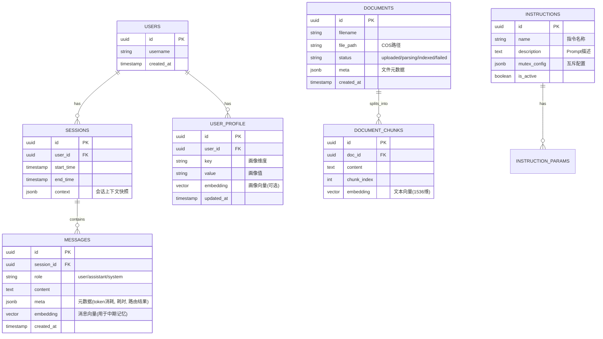

# AI语音语义理解模块 - 技术设计说明书

**版本**：v2.0
**日期**：2026-01-08
**作者**：Manus AI

---

## 1. 引言

### 1.1. 编写目的
本文档旨在为“AI语音语义理解模块”提供全面的技术设计规范，明确系统架构、数据结构、接口定义及核心业务流程。该文档将作为后续代码开发、测试及维护的基准依据。

**v2.0 更新摘要**：
*   新增 **管理后台 (Admin Dashboard)** 架构设计。
*   新增 **实时联网搜索 (Web Search)** 模块。
*   新增 **批量评测 (Batch Evaluation)** 与 **指令导入** 流程。
*   升级 **全链路可观测性 (Traceability)**，API 响应增加元数据透传。

### 1.2. 适用范围
本文档适用于后端开发人员、架构师、前端开发人员及测试人员。

---

## 2. 概要设计 (High-Level Design)

### 2.1. 系统架构图

系统采用分层架构设计，自上而下分为：接入层、业务逻辑层、数据持久层，并依赖外部大模型服务。

```mermaid
graph TD
    Client[客户端 (App/设备)] -->|HTTPS/WSS| Gateway[API 网关 (Nginx/Ingress)]
    AdminUI[管理后台 (Web)] -->|HTTPS| Gateway
    
    subgraph "应用服务层 (Application Layer)"
        API[API Service (FastAPI)]
        
        subgraph "核心模块 (Core Modules)"
            DM[对话管理器 (Dialogue Manager)]
            Router[意图路由 (Intent Router)]
            Executor[指令执行器 (Instruction Executor)]
            RAG[RAG 引擎 (RAG Engine)]
            Memory[记忆管理器 (Memory Manager)]
            Search[搜索服务 (Search Service)]
            Eval[评测服务 (Eval Service)]
        end
        
        API --> DM
        API --> Eval
        DM --> Memory
        DM --> Router
        Router -->|指令| Executor
        Router -->|问答| RAG
        Router -->|闲聊| Chat[通用对话]
        Chat --> Search
    end
    
    subgraph "数据持久层 (Data Layer)"
        Redis[(Redis Cache)]
        PG[(PostgreSQL + pgvector)]
        COS[对象存储 (COS)]
    end
    
    subgraph "外部依赖 (External Services)"
        LLM[大模型 API (OpenAI/Qwen/Minimax)]
        SearchAPI[搜索 API (DuckDuckGo/Tavily)]
    end
    
    Memory --> Redis
    Memory --> PG
    RAG --> PG
    RAG --> COS
    
    Router --> LLM
    Executor --> LLM
    RAG --> LLM
    Chat --> LLM
    Search --> SearchAPI
```

### 2.2. 模块职责划分

| 模块名称 | 核心职责 | 关键技术组件 |
| :--- | :--- | :--- |
| **API Service** | 处理HTTP/WebSocket请求，鉴权，参数校验，响应格式化。 | FastAPI, Pydantic, JWT |
| **Dialogue Manager** | 维护对话状态，协调各子模块调用顺序，处理异常和降级逻辑。 | State Machine, LangChain |
| **Intent Router** | 基于LLM判断用户意图（指令/问答/闲聊），分发请求。 | LLM Routing, Few-shot Prompting |
| **Instruction Executor** | 解析自然语言为结构化指令，处理参数补全和互斥检查。 | OpenAI Function Calling |
| **RAG Engine** | 文档解析、向量检索、重排序、生成答案。 | LangChain, Milvus/PGVector, BGE |
| **Memory Manager** | 管理短/中/长期记忆的读写、压缩和过期策略。 | Redis, PGVector, Summary Chain |
| **Search Service** (New) | 封装外部搜索 API，提供实时信息查询能力。 | DuckDuckGo, Tavily, Serper |
| **Eval Service** (New) | 处理批量评测任务，解析 Excel，统计 Pass/Fail 指标。 | Pandas, OpenPyXL |

---

## 3. 详细设计 (Low-Level Design)

### 3.1. 数据库设计 (PostgreSQL)

采用PostgreSQL作为主数据库，利用 `pgvector` 插件存储向量数据。

#### 3.1.1. ER图 (Entity-Relationship Diagram)



### 3.2. Redis缓存设计
Redis主要用于存储高频访问的短期数据和分布式锁。

| Key Pattern | 类型 | TTL | 说明 |
| :--- | :--- | :--- | :--- |
| `session:{session_id}:history` | List | 30min | 短期记忆队列，存储最近10轮对话。`LPUSH/LTRIM` 维护长度。 |
| `session:{session_id}:state` | Hash | 30min | 当前会话状态机，字段如 `current_intent`, `slot_filling_status`。 |
| `user:{user_id}:lock` | String | 10s | 分布式锁，防止同一用户并发请求导致状态混乱。 |
| `cache:semantic:{query_hash}` | String | 24h | 语义缓存，存储高频问题的标准回答，减少LLM调用。 |

---

### 3.3. API接口定义 (Interface Design)

遵循RESTful规范，所有接口前缀为 `/api/v1`。

#### 3.3.1. 核心对话接口 (Updated)

*   **URL**: `POST /chat/completions`
*   **描述**: 处理用户的语音转文本输入，返回语义理解结果（指令或回复）。
*   **Request Body**:
    ```json
    {
      "session_id": "uuid-string",
      "query": "帮我把微波炉开到大火，加热5分钟",
      "user_id": "user-123",
      "stream": false // 是否流式返回
    }
    ```
*   **Response Body (Success)**:
    ```json
    {
      "code": 0,
      "data": {
        "intent": "instruction", // instruction | qa | chat
        "reply": "好的，已为您开启大火模式，定时5分钟。",
        "actions": [ // 仅在 intent=instruction 时存在
          {
            "name": "start_cooking",
            "parameters": {
              "mode": "high",
              "duration": 300
            }
          }
        ],
        "metadata": { // v2.0 新增元数据
          "trace_id": "uuid...",
          "route": "instruction",
          "latency_ms": 850,
          "models_used": {
            "router": "minimax-m2",
            "executor": "gpt-4o"
          },
          "search_results": [] // 如果触发搜索，此处包含来源链接
        }
      }
    }
    ```

#### 3.3.2. 批量评测接口 (New)

*   **URL**: `POST /admin/eval/batch`
*   **描述**: 上传 Excel 文件进行批量评测。
*   **Content-Type**: `multipart/form-data`
*   **Parameters**: `file` (Excel)
*   **Excel 格式要求**:
    *   `case_id`: 用例编号
    *   `query`: 用户提问
    *   `expected_intent`: 期望意图 (instruction/qa/chat)
    *   `expected_keywords`: 期望回复中包含的关键词 (逗号分隔)
*   **Response**: 返回包含评测结果（Pass/Fail, 耗时, 实际回复）的 Excel 文件流。

#### 3.3.3. 指令导入接口 (New)

*   **URL**: `POST /admin/instructions/import`
*   **描述**: 批量导入指令定义。
*   **Excel 格式要求**:
    *   `name`: 指令名称 (如 `set_fire`)
    *   `description`: 指令描述
    *   `parameters`: JSON 格式的参数定义
    *   `mutex_group`: 互斥组名称

---

### 3.4. 核心业务流程 (Sequence Diagrams)

#### 3.4.1. 语音指令处理流程 (含动态降级与搜索)


---

## 4. 附录

### 4.1. 第三方库选型
*   **Web Framework**: FastAPI (高性能异步框架)
*   **ORM**: SQLAlchemy + asyncpg (异步数据库驱动)
*   **LLM SDK**: LangChain (v0.1.0+)
*   **Vector DB Client**: pymilvus / psycopg2-binary
*   **Search**: duckduckgo-search / tavily-python

### 4.2. 配置项说明
*   `SEARCH_PROVIDER`: string - 搜索服务提供商 (duckduckgo/tavily/serper)
*   `INSTRUCTION_LLM_MODEL`: string - 指令解析专用模型
*   `RAG_LLM_MODEL`: string - RAG 问答专用模型
*   `CHAT_LLM_MODEL`: string - 通用闲聊模型
