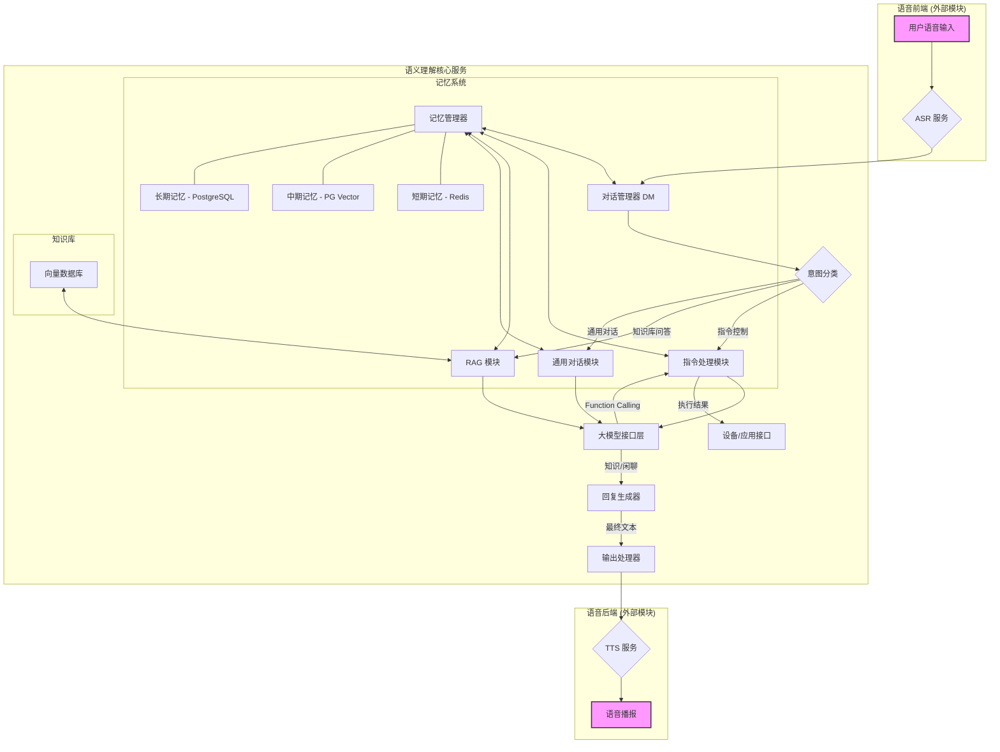

# AI 语音语义理解方案设计文档

| 版本 | 修订日期 | 修订人 | 修订内容 |
| :--- | :--- | :--- | :--- |
| V1.0 | 2025-12-30 | Manus AI | 初稿创建，根据用户输入完成整体方案设计 |

---

## 1. 引言

### 1.1. 项目背景

自2022年底以来，大型语言模型（LLM）技术取得了突破性进展，其强大的通用能力被广泛认为是推动下一次工业革命的核心生产力。在这一背景下，我们旨在利用业内领先的大模型应用技术，为搭载于智能微波炉硬件上的语音产品，构建一套全新的语义理解解决方案。此方案旨在替代传统的基于词法匹配的语义理解方法，以期在用户意图理解的准确性、泛化能力及功能可扩展性上实现质的飞跃。

本方案所服务的智能硬件产品是一款带有大屏幕的微波炉，集成了线性双麦克风阵列和讯飞音频解决方案，主要应用场景覆盖厨房及客厅环境。语音交互内容丰富，涵盖设备控制、菜谱搜索、个性化食谱推荐以及生活百科问答等多个方面。

### 1.2. 设计目标

本次方案设计的核心目标是，构建一套达到商用标准、基于大模型技术的通用语义理解系统。该系统需要具备高准确性、高响应速度和良好的扩展性，能够精准应对复杂的语音交互场景，并为用户提供智能化、个性化的服务体验。具体目标分解如下：

- **高准确性**：精确理解用户意图，尤其在设备控制指令上，必须保证接近100%的准确率。
- **高响应速度**：指令控制类交互的端到端响应时间应控制在2秒以内，力求达到1秒内的快速响应。
- **强泛化性**：能够理解用户多样化的自然语言表达，而非局限于固定指令模板。
- **全场景覆盖**：无缝处理设备控制、知识库问答和通用闲聊三大核心场景。
- **高可扩展性**：技术架构和功能模块应易于扩展，能够便捷地增加新指令、新知识和新功能。

### 1.3. 核心原则

为确保方案的先进性与落地可靠性，整体设计遵循以下核心原则：

- **技术先进性**：全面拥抱大模型技术生态，优先选用业内验证成熟、社区活跃的开源框架与工具。
- **模块化设计**：系统各模块应高度解耦，通过标准化的接口进行通信，便于独立开发、测试、部署和升级。
- **可配置性**：系统的核心参数，如模型配置、对话轮数、超时时间等，均设计为可配置项，以灵活适应不同运营需求。
- **闭环管理**：围绕核心功能（如知识库、指令集、评测等）建立配套的管理后台，实现从数据到应用的全流程闭环管理。

## 2. 产品需求分析

### 2.1. 核心功能域

语义理解系统需要覆盖三大核心功能领域，其优先级和关键需求如下表所示：

| 优先级 | 功能域 | 关键需求描述 |
| :--- | :--- | :--- |
| **1** | **指令控制 (Instruction Control)** | 准确解析并执行设备控制指令，支持多指令组合与互斥逻辑，响应速度要求极高。 |
| **2** | **知识库问答 (Knowledge Base Q&A)** | 基于私有文档（PDF, Word, PPT, TXT等）进行问答，支持图文表混合内容的理解。 |
| **3** | **通用对话 (General Conversation)** | 处理前两者之外的所有对话，包括日常闲聊和基于实时信息的在线问答。 |

### 2.2. 指令控制

#### 2.2.1. 功能列表

系统需支持约40余项设备控制及页面跳转相关的功能，所有功能均通过大模型的Function Calling能力实现。详细的功能定义列表（包含名称、描述、参数结构）参见附录A。

#### 2.2.2. 复合指令支持

系统需要支持用户在单轮对话中下达多个连续或并行的指令。例如，当用户说“大火加热5分钟，然后转小火3分钟”，系统应能正确解析出两个独立的`set_firepower_time`指令，并按序执行。

#### 2.2.3. 互斥指令配置

部分指令在逻辑上是互斥的，不能同时执行。系统需支持通过配置来管理这些互斥关系。该配置采用JSON格式，默认为空，表示不启用互斥检查。

**配置示例**：
```json
{
  "voice_cmd_stop_cooking": {
    "incompatible": ["voice_cmd_start_cooking", "voice_cmd_pause_cooking", "set_firepower_time"]
  }
}
```

#### 2.2.4. 错误处理

当指令执行失败或无法被设备正确处理时，系统应向用户播报统一的、友好的提示语音：“小万还在学习中，请再说一遍”。

### 2.3. 知识库问答

#### 2.3.1. 数据源

知识库的数据来源分为两部分：

1.  **本地文档**：支持用户上传PDF, Word, PPT, TXT等多种格式的私有文档。预估文档规模在20-50份，单份文件大小在2MB至50MB之间。文档需要进行数据清洗。
2.  **实时网络信息**：支持根据用户提供的关键词（Prompt），实时从互联网搜索信息，并将结果整理为结构化数据或文档，作为临时知识源。

#### 2.3.2. 文档处理要求

系统在处理上传的文档时，必须具备以下能力：

- **文本提取**：准确抽离各类文档中的文本内容。
- **图片内容识别**：利用OCR技术识别并提取图片中的文字信息。
- **表格结构化理解**：解析文档中的表格，将其转换为结构化数据（如JSON或Markdown表格），以支持对表格内容的精准问答。

### 2.4. 通用对话

#### 2.4.1. 在线搜索集成

对于通用对话中涉及实时信息（如天气、新闻、股价、日期等）的查询，系统需集成在线搜索能力。这里将采用模型上下文协议（Model Context Protocol, MCP）作为AI在线搜索功能的实现方式，调用外部API获取实时信息并整合到回答中。

#### 2.4.2. 内容安全

通用对话的内容安全遵循所选用大模型自身的安全过滤机制，暂不设置额外的敏感词过滤策略。

## 3. 技术方案设计

本章节将详细阐述实现上述产品需求的整体技术架构、核心模块设计、技术选型以及配套系统方案。

### 3.1. 系统总体架构

系统采用模块化的分层架构，确保各组件的独立性和可维护性。核心处理流程如下图所示：



**核心流程说明**：

1.  **输入处理**：用户的语音输入由外部ASR（语音识别）服务转换为文本。
2.  **对话管理**：对话管理器（DM）接收文本，并结合记忆系统中的上下文，进行意图分类，判断用户请求属于指令控制、知识库问答还是通用对话。
3.  **任务分发**：根据意图分类结果，请求被分发到相应的处理模块。
4.  **模块处理**：
    *   **指令处理模块**：利用大模型的Function Calling能力解析指令和参数。
    *   **RAG模块**：从向量数据库中检索相关知识，并结合用户问题生成答案。
    *   **通用对话模块**：直接调用大模型进行对话，或集成MCP进行在线搜索后回答。
5.  **回复生成与输出**：各模块生成的文本回复经输出处理器格式化后，交由外部TTS（文本转语音）服务合成语音并播报给用户。

### 3.2. 核心模块详解

#### 3.2.1. 对话管理器 (Dialogue Manager)

对话管理器是整个系统的中枢，其核心职责是进行精准的**意图分类（Intent Classification）**。我们将采用基于大模型的路由策略（LLM-based Routing）来实现。

- **实现方式**：推荐使用开源框架如 `LangChain` 的 `RouterChain` 或 `Semantic Router`。通过向大模型提供各个功能域（指令、知识库、闲聊）的详细描述，让模型根据用户输入自主判断其意图归属。
- **优先级处理与动态降级**：路由规则遵循 **指令控制 > 知识库问答 > 通用对话** 的优先级，但具备动态降级（Fallback）机制。
    1.  **指令控制**：优先匹配。
    2.  **知识库问答**：若指令匹配失败，且知识库服务可用（已配置且有数据），则尝试检索。**关键逻辑**：如果知识库模块返回空结果（无相关文档或服务未就绪），系统将自动跳过此环节，直接流转至通用对话模块。这意味着系统链路是动态可变的：在知识库建设初期，链路可能退化为“指令 -> 通用对话”。
    3.  **通用对话**：作为兜底策略，处理所有未被前两者捕获的请求。

#### 3.2.2. 指令处理模块

该模块负责处理所有设备控制相关的指令。

- **Function Calling**：将附录A中的所有指令严格按照OpenAI Function Calling的JSON Schema格式进行定义，作为工具（Tools）提供给大模型。
- **复合指令处理**：在单轮对话中，允许大模型一次调用多个（`parallel_tool_calls`）或序列化的Function Call，从而实现复合指令的解析。
- **互斥指令检查**：在接收到模型返回的Function Call列表后，业务逻辑层会根据2.2.3节中定义的互斥配置进行检查。若发现互斥指令，则拒绝执行并向用户返回错误提示。

#### 3.2.3. RAG（检索增强生成）模块

该模块用于实现高质量的知识库问答，其构建分为**离线处理**和**在线检索**两个阶段。

**离线处理流程**：

1.  **文档加载与解析**：使用 `Unstructured` 或 `PyMuPDF` 等库加载用户上传的多种格式文档。该步骤会同时处理文档中的图片（OCR）和表格（结构化）。
2.  **文本分块 (Chunking)**：采用递归字符分割（Recursive Character Text Splitter）等策略，将长文本切分为语义完整、大小适中的块。
3.  **向量化 (Embedding)**：调用Embedding模型（如BGE, M3E等）将文本块转换为向量。
4.  **数据入库**：将文本块及其对应的向量索引存入向量数据库（如Milvus, Qdrant）。

**在线检索流程**：

1.  **查询向量化**：将用户的提问通过相同的Embedding模型转换为查询向量。
2.  **向量检索**：在向量数据库中进行相似度搜索，召回Top-K个最相关的文本块。
3.  **重排序 (Reranking)**：引入重排序模型（如 `bge-reranker`）对召回的文本块进行二次排序，提升最相关内容在上下文中的位置。
4.  **生成答案**：将排序后的文本块作为上下文（Context）与用户原始问题一同提交给大模型，生成最终答案。

#### 3.2.4. 记忆系统

为了提供连贯和个性化的对话体验，系统将实现一个三层记忆系统，由统一的记忆管理器进行调度，并以用户账号作为唯一标识进行数据隔离。

| 记忆类型 | 定义 | 存储内容 | 存储载体 | 生命周期/压缩策略 |
| :--- | :--- | :--- | :--- | :--- |
| **短期记忆** | 当前单轮会话 | 最近10轮的完整对话历史（Q&A对） | Redis | FIFO队列，超过10轮自动丢弃 |
| **中期记忆** | 近期历史会话 | 最近30天的所有会话记录 | PostgreSQL (使用`pgvector`插件) | **摘要压缩**：每日定时任务将前一天的对话历史进行摘要，存储摘要和对应的向量 |
| **长期记忆** | 用户画像 | 用户的静态和动态标签 | PostgreSQL | 永久有效，通过业务接口更新 |

**数据可用性检查（Data Availability Check）**：

记忆系统的调用遵循“宁缺毋滥”原则。在每次读取记忆（特别是中期和长期记忆）前，系统必须执行可用性检查：
- **冷启动处理**：如果用户是首次使用，或相应的记忆存储（如PostgreSQL中的用户画像表）为空，系统将静默处理，即返回空上下文，而不阻断主流程或报错。
- **服务降级**：若记忆存储服务（如Redis或PG）暂时不可用，系统应记录错误日志但继续执行对话流程，仅在当前轮次暂时屏蔽记忆功能。

**用户画像维度示例**：

- **静态信息**：性别、年龄、籍贯、所在城市、宗教、民族、身高、体重、工作。
- **动态偏好**：口味偏好（如“喜欢辣”）、常用指令（如“常用‘大火’模式”）、交互习惯等。

#### 3.2.5. 大模型接口层

为支持多厂商、多系列的大模型，需要构建一个统一的接口层。

- **统一适配器**：使用 `LiteLLM` 或自定义适配器模式，将不同模型提供商（Azure, Qwen, Gemini等）的API请求和响应格式统一。所有模型的URL和API Key通过配置文件管理。
- **模型选择策略**：支持通过配置文件手动为不同场景（指令、RAG、闲聊）指定不同模型。默认情况下，所有场景使用同一个模型。未来可扩展为基于性能和成本的动态路由策略。
- **流式/非流式支持**：接口层将统一支持流式和非流式两种返回模式，具体使用哪种模式由上层业务模块根据场景决定（建议：指令控制用非流式，通用对话和知识问答用流式）。

### 3.3. 系统实施与配套方案

#### 3.3.1. 推荐技术选型

为加速开发进程并确保方案的成熟可靠，推荐采用以下业内主流的开源技术栈：

| 模块 | 推荐技术/工具 | 作用 |
| :--- | :--- | :--- |
| **大模型开发框架** | LangChain / LlamaIndex | 提供构建LLM应用的完整工具链，简化开发。 |
| **Web服务框架** | FastAPI / Flask | 用于构建对外提供服务的API接口。 |
| **文档解析** | Unstructured, PyMuPDF | 支持多种文档格式的文本、图片、表格提取。 |
| **向量数据库** | Milvus / Qdrant / ChromaDB | 高效存储和检索向量数据，是RAG的核心。 |
| **Embedding模型** | BGE-M3, text-embedding-3-small | 将文本转换为高质量的向量表示。 |
| **重排序模型** | bge-reranker-base | 提升RAG检索结果的相关性。 |
| **多模型接口** | LiteLLM | 统一调用不同厂商的大模型API。 |
| **数据库** | PostgreSQL (with pgvector) | 存储中期记忆、长期记忆及其他业务数据。 |
| **缓存数据库** | Redis | 存储短期记忆，实现快速读写。 |

#### 3.3.2. 部署方案

本方案提供两套完整的部署策略：一套用于生产环境的腾讯云部署方案，确保高可用与弹性伸缩；另一套用于开发调试阶段的Windows本地部署方案，便于快速迭代与验证。

##### 3.3.2.1. 线上部署方案（腾讯云）

生产环境采用基于容器化的云原生架构，利用腾讯云的成熟PaaS服务来降低运维成本并提升系统稳定性。

**核心服务选型**：

| 服务模块 | 腾讯云产品 | 规格/配置建议 | 说明 |
| :--- | :--- | :--- | :--- |
| **容器集群** | TKE (腾讯云容器服务) | 标准托管集群 | 托管K8s Master节点，仅需管理Worker节点，降低运维复杂度。 |
| **计算资源** | CVM (云服务器) | 标准型S5 / 4核8G * 3台 | 作为K8s Worker节点，承载应用容器。建议配置弹性伸缩组(ASG)。 |
| **数据库** | TDSQL-C (PostgreSQL版) | Serverless版 / 2核4G | 兼容PostgreSQL，支持pgvector插件，用于存储记忆和向量数据。Serverless模式可按需自动扩缩容。 |
| **缓存服务** | Redis (云数据库Redis) | 标准架构 / 4G | 用于存储短期记忆和会话状态，保障低延迟读写。 |
| **负载均衡** | CLB (负载均衡) | 公网/内网型 | 作为流量入口，分发请求至TKE集群中的Ingress Controller。 |
| **对象存储** | COS (对象存储) | 标准存储 | 用于持久化存储用户上传的原始文档（PDF/Word等）。 |
| **日志监控** | CLS (日志服务) + 云监控 | 标准版 | 采集容器日志和系统指标，配置告警策略。 |

**部署架构图**：

```mermaid
graph TD
    User[用户/设备] --> CLB[腾讯云 CLB]
    CLB --> Ingress[K8s Ingress]
    
    subgraph "TKE 容器集群"
        Ingress --> API[API 网关服务]
        API --> DM[对话管理服务]
        DM --> RAG[RAG 检索服务]
        DM --> Chat[通用对话服务]
    end
    
    DM --> Redis[腾讯云 Redis]
    RAG --> PG[TDSQL-C (PGVector)]
    DM --> PG
    RAG --> COS[腾讯云 COS]
    
    subgraph "外部服务"
        LLM[大模型 API]
        Search[在线搜索 API]
    end
    
    DM --> LLM
    RAG --> LLM
    Chat --> LLM
    Chat --> Search
```

**实施步骤**：

1.  **基础设施即代码 (IaC)**：推荐使用Terraform编写腾讯云资源编排脚本，实现基础设施的自动化创建与管理。
2.  **CI/CD流水线**：利用腾讯云CODING DevOps或GitHub Actions，构建自动化流水线。代码提交后自动触发Docker镜像构建，推送到TCR（腾讯云容器镜像服务），并自动更新TKE集群中的Deployment。
3.  **服务网格 (可选)**：对于微服务间的通信治理，可视情况启用TKE集成的Istio服务网格，实现流量控制和熔断降级。

##### 3.3.2.2. 本地调试方案（Windows）

在开发和初步验证阶段，使用Windows本地环境进行部署。由于Windows环境与Linux生产环境存在差异，推荐使用WSL2 (Windows Subsystem for Linux 2) 或 Docker Desktop for Windows 来屏蔽底层差异，确保环境一致性。

**环境准备**：

*   **操作系统**：Windows 10/11 专业版或企业版（推荐）。
*   **基础软件**：
    *   **Docker Desktop**：必须安装，并开启WSL2后端支持。这是运行向量数据库（Milvus/Qdrant）和Redis等中间件的最便捷方式。
    *   **Python 3.10+**：建议使用 `Conda` (Miniconda/Anaconda) 创建独立的虚拟环境，避免依赖冲突。
    *   **Git**：用于代码版本控制。
    *   **PostgreSQL (Windows版)**：虽然Docker也可运行PG，但为了数据持久化和管理方便，也可直接安装Windows原生版本，并手动安装 `pgvector` 插件（需编译或下载预编译版）。或者直接使用Docker运行带有pgvector的镜像（推荐 `pgvector/pgvector:pg16`）。

**本地架构配置**：

1.  **中间件启动 (Docker Compose)**：
    编写 `docker-compose-dev.yml` 文件，一键启动所有依赖服务：
    ```yaml
    version: '3.8'
    services:
      redis:
        image: redis:7-alpine
        ports:
          - "6379:6379"
      
      postgres:
        image: pgvector/pgvector:pg16
        environment:
          POSTGRES_USER: dev_user
          POSTGRES_PASSWORD: dev_password
          POSTGRES_DB: ai_voice_db
        ports:
          - "5432:5432"
        volumes:
          - ./pg_data:/var/lib/postgresql/data

      milvus: # 如果选用Milvus作为向量库
        image: milvusdb/milvus:v2.3.0
        # ... (Milvus标准配置)
    ```
    在PowerShell中运行 `docker-compose -f docker-compose-dev.yml up -d` 即可启动。

2.  **应用服务运行**：
    *   在Conda环境中安装项目依赖：`pip install -r requirements.txt`。
    *   配置本地环境变量文件 `.env`，指向本地的Redis和PostgreSQL端口，以及配置大模型的API Key。
    *   使用IDE（如PyCharm或VS Code）直接运行Python入口脚本（如 `main.py`）启动API服务。

3.  **调试工具**：
    *   **Postman / Apifox**：用于调试API接口。
    *   **DBeaver**：连接本地PostgreSQL数据库，查看记忆和向量数据。
    *   **Redis Desktop Manager**：查看Redis中的短期记忆数据。

**注意事项**：
*   **路径问题**：Windows文件路径使用反斜杠`\`，而代码中通常使用正斜杠`/`。建议在代码中使用 `os.path.join` 或 `pathlib` 库来处理路径，以保证跨平台兼容性。
*   **编码问题**：Windows默认编码可能为GBK，而Linux为UTF-8。务必在打开文件时显式指定 `encoding='utf-8'`，并设置环境变量 `PYTHONUTF8=1`。

#### 3.3.3. 管理后台功能设计

为实现对系统的全方位管理和维护，需要构建一个配套的管理后台。后台核心功能模块如下：

| 模块 | 功能描述 | 程序化默认处理 |
| :--- | :--- | :--- |
| **文档知识库管理** | 提供文档上传、解析、向量化、删除和更新的界面化操作。可查看文档处理状态和知识库统计信息。 | - |
| **指令配置管理** | 以UI形式管理Function Calling指令集，包括增删改查指令定义、配置指令互斥关系。 | 系统启动时，若无数据库配置，则默认从本地JSON配置文件加载指令集。 |
| **模型配置管理** | 管理各大模型厂商的API Key和Endpoint，并为不同场景（指令/RAG/闲聊）指派具体使用的模型。 | 系统启动时，若无数据库配置，则默认从本地YAML或env文件加载模型配置。 |
| **批量测试管理** | 上传测试集文件，选择待测模型和服务版本，触发批量测试任务，并可视化展示评测报告。 | 提供命令行脚本，支持开发者在本地运行批量测试，并将结果输出为CSV或JSON文件。 |

#### 3.3.4. 批量测试方案

批量测试是保障语义理解质量和迭代优化的关键环节。

- **测试数据集**：测试集以 `JSONL` 格式组织，每一行代表一个测试用例。

  **测试用例格式示例**：
  ```json
  {
    "case_id": "intent_001",
    "query": "帮我用大火热5分钟",
    "expected_intent": "指令控制",
    "expected_function_call": {
      "name": "set_firepower_time",
      "arguments": {
        "firepower": "大火",
        "duration": 300
      }
    }
  }
  ```

- **评测维度与方法**：

| 评测维度 | 评测方法 |
| :--- | :--- |
| **意图识别准确率** | 对比系统判定的意图与 `expected_intent` 是否一致。 |
| **参数提取准确率** | 对比系统解析出的Function Call名称和参数与 `expected_function_call` 是否完全一致。 |
| **响应时间** | 记录从接收请求到返回最终结果的端到端耗时。 |
| **回复质量** | 对于知识问答和闲聊场景，使用一个更高阶的LLM（如GPT-4）作为裁判，对模型的回复进行打分（1-5分）。 |

- **评测报告**：每次批量测试后，系统将自动生成详细的评测报告，包含各维度的汇总统计数据、与历史版本的对比分析以及错误案例的详细列表，为模型调优和算法迭代提供数据支持。

## 附录A：Function Calling 指令列表

```json
[
    {
        "type": "function",
        "function": {
            "name": "voice_cmd_start_cooking",
            "description": "启动烹饪，帮助用户启动万得厨微波炉开始烹饪食物",
            "parameters": {}
        }
    },
    {
        "type": "function",
        "function": {
            "name": "voice_cmd_pause_cooking",
            "description": "暂停烹饪，帮助用户暂停万得厨微波炉的烹饪进程",
            "parameters": {}
        }
    },
    {
        "type": "function",
        "function": {
            "name": "voice_cmd_continue_cooking",
            "description": "继续烹饪，帮助用户继续/恢复万得厨微波炉的烹饪进程",
            "parameters": {}
        }
    },
    {
        "type": "function",
        "function": {
            "name": "voice_cmd_stop_cooking",
            "description": "终止烹饪，帮助用户终止/结束/退出万得厨微波炉的烹饪进程",
            "parameters": {}
        }
    },
    {
        "type": "function",
        "function": {
            "name": "remaining_cooking_time_query",
            "description": "播报烹饪剩余时间，告知用户当前万得厨微波炉烹饪的剩余时长",
            "parameters": {}
        }
    },
    {
        "type": "function",
        "function": {
            "name": "cooking_unfreeze",
            "description": "解冻，帮助用户设置解冻模式后直接进入启动程序",
            "parameters": {
                "type": "object",
                "properties": {
                    "food": {
                        "type": "string",
                        "description": "要解冻的食材、食品名称（非必须），例如猪肉、牛肉、羊肉、烤肠、梅菜扣肉、鳗鱼炒饭、猪肉玉米水饺等。"
                    }
                }
            }
        }
    },
    {
        "type": "function",
        "function": {
            "name": "set_cooking_temp",
            "description": "设置烹饪温度，帮助用户设置烹饪/加热的温度值",
            "parameters": {
                "type": "object",
                "properties": {
                    "cooking_temp": {
                        "type": "number",
                        "description": "要设置的烹饪温度，取值范围 20-100，单位为度，例如35、54、60、89 等。"
                    }
                },
                "required": [
                    "cooking_temp"
                ]
            }
        }
    },
    {
        "type": "function",
        "function": {
            "name": "set_firepower_time",
            "description": "设置火力+时间，帮助用户设置烹饪/加热的火力模式和时间",
            "parameters": {
                "type": "object",
                "properties": {
                    "firepower": {
                        "type": "string",
                        "enum": [
                            "小火",
                            "中火",
                            "大火"
                        ],
                        "description": "要设置的火力模式，取值范围不能超出’enum‘， 但若有相近值可转化为’enum‘中的值。\n 小火的相近值有[低火、微火、最小火]；中火的相近值有[中等火力、中档火]；大火的相近值有[高火、最大火力、最高火力、最大火、最高火]。"
                    },
                    "duration": {
                        "type": "number",
                        "description": "要设置的烹饪烹饪时长，单位为秒（s），请将其他单位转化为秒，例如 100s、七分钟=420s、五分半=330s，时间最长为 40 分钟。"
                    }
                },
                "required": [
                    "firepower",
                    "duration"
                ]
            }
        }
    },
    {
        "type": "function",
        "function": {
            "name": "set_firepower",
            "description": "设置火力，帮助用户设置烹饪/加热的火力模式",
            "parameters": {
                "type": "object",
                "properties": {
                    "firepower": {
                        "type": "string",
                        "enum": [
                            "小火",
                            "中火",
                            "大火"
                        ],
                        "description": "要设置的火力模式，取值范围不能超出’enum‘， 但若有相近值可转化为’enum‘中的值。\n 小火的相近值有[低火、微火、最小火]；中火的相近值有[中等火力、中档火]；大火的相近值有[高火、最大火力、最高火力、最大火、最高火]。"
                    }
                },
                "required": [
                    "firepower"
                ]
            }
        }
    },
    {
        "type": "function",
        "function": {
            "name": "set_cooking_time",
            "description": "设置烹饪时间，帮助用户设置烹饪/加热的时间",
            "parameters": {
                "type": "object",
                "properties": {
                    "duration": {
                        "type": "number",
                        "description": "要设置的烹饪烹饪时长，单位为秒（s），请将其他单位转化为秒，例如 100s、七分钟=420s、五分半=330s。"
                    }
                },
                "required": [
                    "duration"
                ]
            }
        }
    },
    {
        "type": "function",
        "function": {
            "name": "jump_to_page",
            "description": "打开指定页面，帮助用户跳转/进入/切换到指定页面",
            "parameters": {
                "type": "object",
                "properties": {
                    "page_name": {
                        "type": "string",
                        "enum": [
                            "使用帮助页",
                            "语言切换页",
                            "设备信息页",
                            "网络设置页",
                            "设置页"
                        ],
                        "description": "要打开的页面名称，取值范围不能超出’enum‘， 但若有相近值可转化为’enum‘中的值。\n 使用帮助页的相近值有[使用帮助、使用指南、使用说明、帮助页、帮助、系统帮助]；设置页的相近值有[设置、系统设置]；\n 语言切换页的相近值有[语言切换、语言选择、选择语言、语言更换、换语言、切换语言]；智能烹饪页的相近值有[智能烹饪、AI 烹饪情]；\n 设备信息页的相近值有[设备信息、设备详情、设备信息详情]；\n 网络设置页的相近值有[网络设置、联网、WiFi 设置、WiFi 连接、WiFi、wifi、wifi 设置、网络信息]。"
                    }
                },
                "required": [
                    "page_name"
                ]
            }
        }
    },
    {
        "type": "function",
        "function": {
            "name": "back_home_page",
            "description": "返回首页，帮助用户回到/进入/跳转到首页/主页",
            "parameters": {}
        }
    },
    {
        "type": "function",
        "function": {
            "name": "volume_up",
            "description": "调高音量，帮助用户增大/提高/升高音量",
            "parameters": {
                "type": "object",
                "properties": {
                    "volume_value": {
                        "type": "number",
                        "description": "要增加的音量值（默认值为 10），取值范围 1-100，例如35%=35、百分之五十=50 等。"
                    }
                }
            }
        }
    },
    {
        "type": "function",
        "function": {
            "name": "volume_down",
            "description": "调低音量，帮助用户减小/降低/调小音量",
            "parameters": {
                "type": "object",
                "properties": {
                    "volume_value": {
                        "type": "number",
                        "description": "要降低的音量值（默认值为 10），取值范围 1-100，例如35%=35、百分之五十=50 等。"
                    }
                }
            }
        }
    },
    {
        "type": "function",
        "function": {
            "name": "volume_value",
            "description": "设置音量为目标值，帮助用户将音量调节/设置/到指定值",
            "parameters": {
                "type": "object",
                "properties": {
                    "volume_value": {
                        "type": "number",
                        "description": " 要设 置的目标音量 值，取值 范围 0-100，例如10、35%=35、百分之五十=50、0 等。"
                    }
                },
                "required": [
                    "volume_value"
                ]
            }
        }
    },
    {
        "type": "function",
        "function": {
            "name": "volume_max",
            "description": "设置最高音量，帮助用户将音量调整/设置/到最高值",
            "parameters": {}
        }
    },
    {
        "type": "function",
        "function": {
            "name": "bright_up",
            "description": "调高亮度，帮助用户增大/提高/升高屏幕亮度",
            "parameters": {
                "type": "object",
                "properties": {
                    "bright_value": {
                        "type": "number",
                        "description": "要增加的亮度值（默认值为 10），取值范围 1-100，例如35%=35、百分之五十=50 等。"
                    }
                }
            }
        }
    },
    {
        "type": "function",
        "function": {
            "name": "bright_down",
            "description": "调低亮度，帮助用户减少/降低/调小屏幕亮度",
            "parameters": {
                "type": "object",
                "properties": {
                    "bright_value": {
                        "type": "number",
                        "description": "要降低的亮度值（默认值为 10），取值范围 1-100，例如35%=35、百分之五十=50 等。"
                    }
                }
            }
        }
    },
    {
        "type": "function",
        "function": {
            "name": "bright_value",
            "description": "设置亮度为目标值，帮助用户将屏幕亮度调节/设置/调整到指定值",
            "parameters": {
                "type": "object",
                "properties": {
                    "bright_value": {
                        "type": "number",
                        "description": " 要设 置的目标亮度值，取值 范围 0-100，例如10、35%=35、百分之五十=50、0 等。"
                    }
                },
                "required": [
                    "bright_value"
                ]
            }
        }
    },
    {
        "type": "function",
        "function": {
            "name": "bright_max",
            "description": "设置最高亮度，帮助用户将屏幕亮度调整/设置/到最大值",
            "parameters": {}
        }
    },
    {
        "type": "function",
        "function": {
            "name": "bright_min",
            "description": "设置最低亮度，帮助用户将屏幕亮度调整/设置/到最小值",
            "parameters": {}
        }
    },
    {
        "type": "function",
        "function": {
            "name": "role_switch",
            "description": "切换角色，帮助用户调整/设置/更换或使用指定的虚拟人/语音助手角色",
            "parameters": {
                "type": "object",
                "properties": {
                    "ordinal": {
                        "type": "string",
                        "description": "要切换的虚拟人角色序号，格式为‘第 N’，N 的取值范围1-100，若有相近描述需转化为标准的格式。\n 例如第 1=编号 1、第 2=编号 2、第51=倒数第 1=最后一=最后 1、第 52=倒数第 2 等。"
                    }
                }
            }
        }
    },
    {
        "type": "function",
        "function": {
            "name": "screen_off",
            "description": "息屏/黑屏/锁屏/待机/休眠，帮助用户息灭屏幕",
            "parameters": {}
        }
    },
    {
        "type": "function",
        "function": {
            "name": "screen_off_timeout",
            "description": "设置屏幕进入休眠时间，帮助用户调整/设置/修改/选择屏幕关闭/熄灭/休眠/息屏/黑屏时间",
            "parameters": {
                "type": "object",
                "properties": {
                    "timeout": {
                        "type": "string",
                        "enum": [
                            "15 秒",
                            "30 秒",
                            "1 分钟",
                            "2 分钟",
                            "5 分钟",
                            "10 分钟",
                            "永不"
                        ],
                        "description": "要设置的休眠时间，取值范围不能超出’enum‘， 但若有相近值可转化为’enum‘中的值。\n15 秒的相近值有[十五秒]；30 秒的相近值有[三十秒]；1 分钟的相近值有[1 分、一分钟、一分]；2 分钟的相近值有[2 分、两分钟、二分钟、两分]；\n5 分钟的相近值有[5 分、五分钟、五分]；10 分钟的相近值有[10分、十分钟、十分]；永不的相近值有[不休眠、永久]。"
                    }
                }
            }
        }
    },
    {
        "type": "function",
        "function": {
            "name": "mute",
            "description": "开启静音，帮助用户启用/打开/设置/进入/调到/静音模式",
            "parameters": {}
        }
    },
    {
        "type": "function",
        "function": {
            "name": "unmute",
            "description": "解除静音，帮助用户关闭/取消/退出静音模式",
            "parameters": {}
        }
    },
    {
        "type": "function",
        "function": {
            "name": "select_list_id",
            "description": "选择序号，帮助用户在当前页面选择/打开指定序号的食谱/菜谱",
            "parameters": {
                "type": "object",
                "properties": {
                    "ordinal": {
                        "type": "string",
                        "description": "要选择的序号，格式为‘第 N’，N 的取值范围 1-100，若有相近描述需转化为标准的格式。\n 例如第 1=编号 1、第 2=编号 2、第 51=倒数第1=最后一=最后 1、第 52=倒数第 2 等。"
                    }
                },
                "required": [
                    "ordinal"
                ]
            }
        }
    },
    {
        "type": "function",
        "function": {
            "name": "child_lock_on",
            "description": "锁定儿童锁，帮助用户开启/打开/启用/使用儿童锁功能",
            "parameters": {}
        }
    },
    {
        "type": "function",
        "function": {
            "name": "child_lock_off",
            "description": "解锁儿童锁，帮助用户解除/停用/去除/关闭/取消儿童锁功能",
            "parameters": {}
        }
    },
    {
        "type": "function",
        "function": {
            "name": "set_theme_next",
            "description": "切换主题，帮助用户切换/调整/设置/更换或使用指定序号的主题/风格/样式/背景",
            "parameters": {
                "type": "object",
                "properties": {
                    "ordinal": {
                        "type": "string",
                        "description": "要切换的主题序号，格式为‘第 N’，N 的取值范围 1-100，若有相近描述需转化为标准的格式。\n 例如第 1=编号 1、第 2=编号 2、第51=倒数第 1=最后一=最后 1、第 52=倒数第 2 等。"
                    }
                }
            }
        }
    },
    {
        "type": "function",
        "function": {
            "name": "set_theme_previous",
            "description": "换回上一个主题，帮助用户切回/换回/改为上一个主题/风格/样式/背景",
            "parameters": {}
        }
    },
    {
        "type": "function",
        "function": {
            "name": "set_taste",
            "description": "选择口感，帮助用户设置/选择/调整烹饪的口感",
            "parameters": {
                "type": "object",
                "properties": {
                    "taste": {
                        "type": "string",
                        "enum": [
                            "脆嫩",
                            "Q 弹",
                            "紧实",
                            "绵软",
                            "软糯",
                            "软烂",
                            "嫩滑",
                            "脆爽",
                            "爽滑",
                            "默认",
                            "焦一点"
                        ],
                        "description": "要设置的口感，取值范围不能超出’enum‘， 但若有相近值可转化为’enum‘中的值。\n 脆爽的相近值有[脆一点、爽脆、脆脆的]；嫩滑的相近值有[滑嫩、软滑]；软烂的相近值有[烂一点、老一点、软软、软一点]；软糯的相近值有[糯一点、糯糯、糯叽叽、糯滑、粘糯]；\n 焦一点的相近值有[焦一点、焦焦的]；默认的相近值有[推荐]；Q 弹的相近值有[弹韧、Q Q 弹弹、有弹性]；紧实的相近值有[紧致、密实、筋道、有嚼劲、劲道]。"
                    },
                    "food": {
                        "type": "string",
                        "description": "要烹饪的食物名称（非必须），例如猪肉、牛肉、羊肉、包子、红烧肉、烤肠、姜丝牛杂等。"
                    }
                },
                "required": [
                    "taste"
                ]
            }
        }
    },
    {
        "type": "function",
        "function": {
            "name": "set_foodtype",
            "description": "选择食物，帮助用户设置/选择/调整烹饪的食物品类",
            "parameters": {
                "type": "object",
                "properties": {
                    "food": {
                        "type": "string",
                        "description": "要烹饪的食物，例如清烹饪韭菜、爆炒肥肠、牛肉、鸡肉等等。"
                    }
                },
                "required": [
                    "food"
                ]
            }
        }
    },
    {
        "type": "function",
        "function": {
            "name": "set_foodtype_taste",
            "description": "选择食物品类+口感，帮助用户设置/选择/调整烹饪的食物品类和口感",
            "parameters": {
                "type": "object",
                "properties": {
                    "food": {
                        "type": "string",
                        "description": "要烹饪的食物，例如清烹饪韭菜、爆炒肥肠、牛肉、鸡肉等等。"
                    },
                    "taste": {
                        "type": "string",
                        "enum": [
                            "脆嫩",
                            "Q 弹",
                            "紧实",
                            "绵软",
                            "软糯",
                            "软烂",
                            "嫩滑",
                            "脆爽",
                            "爽滑",
                            "默认",
                            "焦一点"
                        ],
                        "description": "要设置的口感，取值范围不能超出’enum‘， 但若有相近值可转化为’enum‘中的值。\n 脆爽的相近值有[脆一点、爽脆、脆脆的]；嫩滑的相近值有[滑嫩、软滑]；软烂的相近值有[烂一点、老一点、软软、软一点]；软糯的相近值有[糯一点、糯糯、糯叽叽、糯滑、粘糯]；\n 焦一点的相近值有[焦一点、焦焦的]；默认的相近值有[推荐]；Q 弹的相近值有[弹韧、Q Q 弹弹、有弹性]；紧实的相近值有[紧致、密实、筋道、有嚼劲、劲道]。"
                    }
                },
                "required": [
                    "food",
                    "taste"
                ]
            }
        }
    },
    {
        "type": "function",
        "function": {
            "name": "set_food_cooking_temp",
            "description": "设置指定食物烹饪温度，帮助用户设置指定食物烹饪/加热的温度值",
            "parameters": {
                "type": "object",
                "properties": {
                    "cooking_temp": {
                        "type": "number",
                        "description": "要设置的烹饪温度，取值范围 20-100，单位为度，例如35、54、60、89 等。"
                    },
                    "food": {
                        "type": "string",
                        "description": "要烹饪的食品名称（非必须），例如红糖糍粑、阿粤广式猪肉肠粉、安井黑椒牛肉酥皮馅饼、奥尔良鸡翅、白米饭等。"
                    }
                },
                "required": [
                    "cooking_temp"
                ]
            }
        }
    },
    {
        "type": "function",
        "function": {
            "name": "AI_cooking_page_open",
            "description": "帮用户打开智能烹饪页面，智能烹饪页面的相近词有 AI 烹饪、智慧烹饪",
            "parameters": {}
        }
    },
    {
        "type": "function",
        "function": {
            "name": "DIY_cooking_page_open",
            "description": "帮用户打开自助烹饪页面，自助烹饪页面的相近词有 DIY 烹饪、手动烹饪",
            "parameters": {}
        }
    },
    {
        "type": "function",
        "function": {
            "name": "heat_cooking_page_open",
            "description": "帮用户打开智能复热页面，智能复热页面的相近词有复热、定温加热、恒温加热、定温烹饪、恒温烹饪、加热、加热页面",
            "parameters": {
                "type": "object",
                "properties": {
                    "food": {
                        "type": "string",
                        "description": "要烹饪的食品名称（非必须），例如红糖糍粑、阿粤广式猪肉肠粉、安井黑椒牛肉酥皮馅饼、奥尔良鸡翅、白米饭等。"
                    }
                }
            }
        }
    }
]
```
