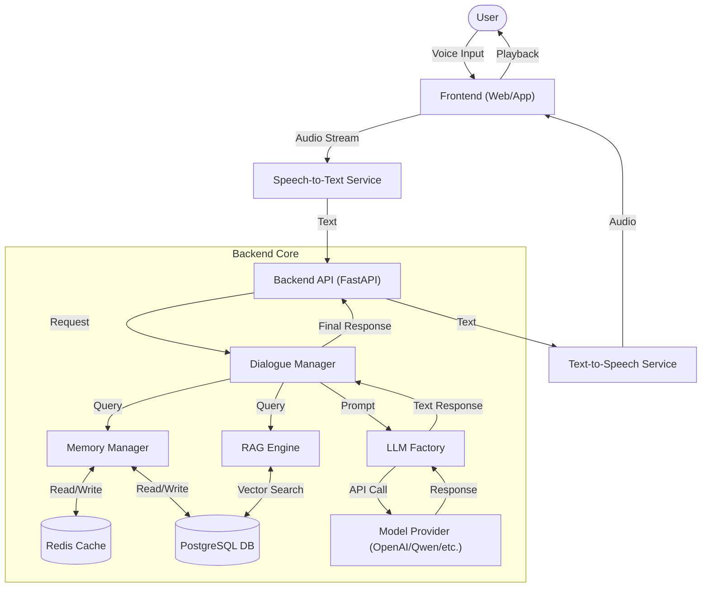
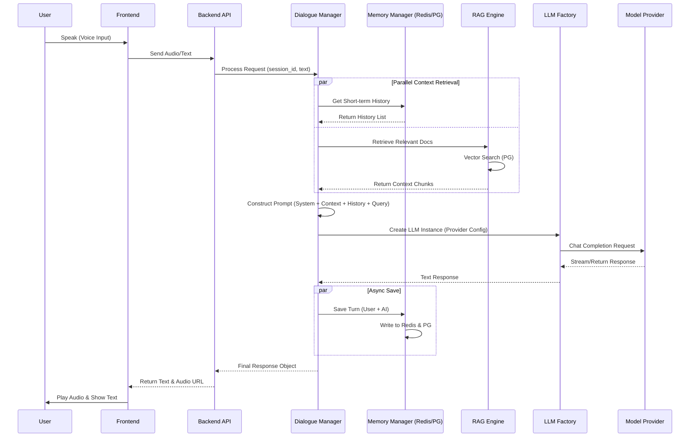

# System Architecture Diagrams

## 1. System Flowchart (系统流程图)

This flowchart illustrates the high-level data flow from the user's voice input to the final audio response.

## 2. Sequence Diagram (时序图)

This sequence diagram details the interaction between system components during a typical conversation turn.

